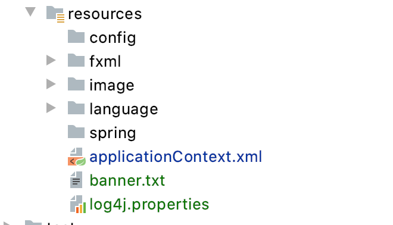
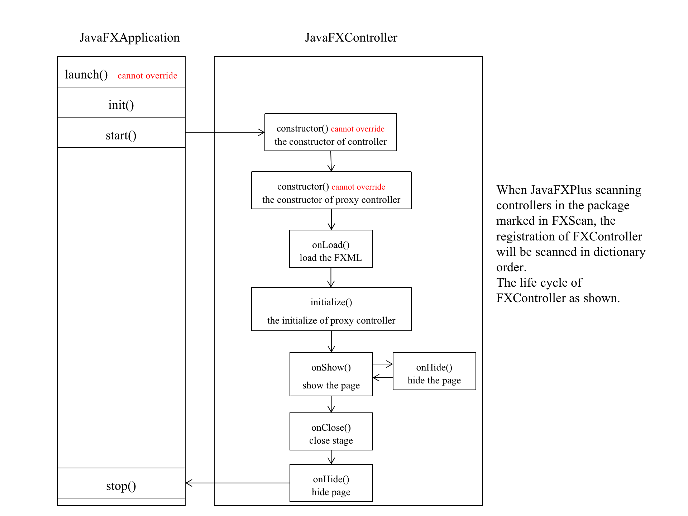
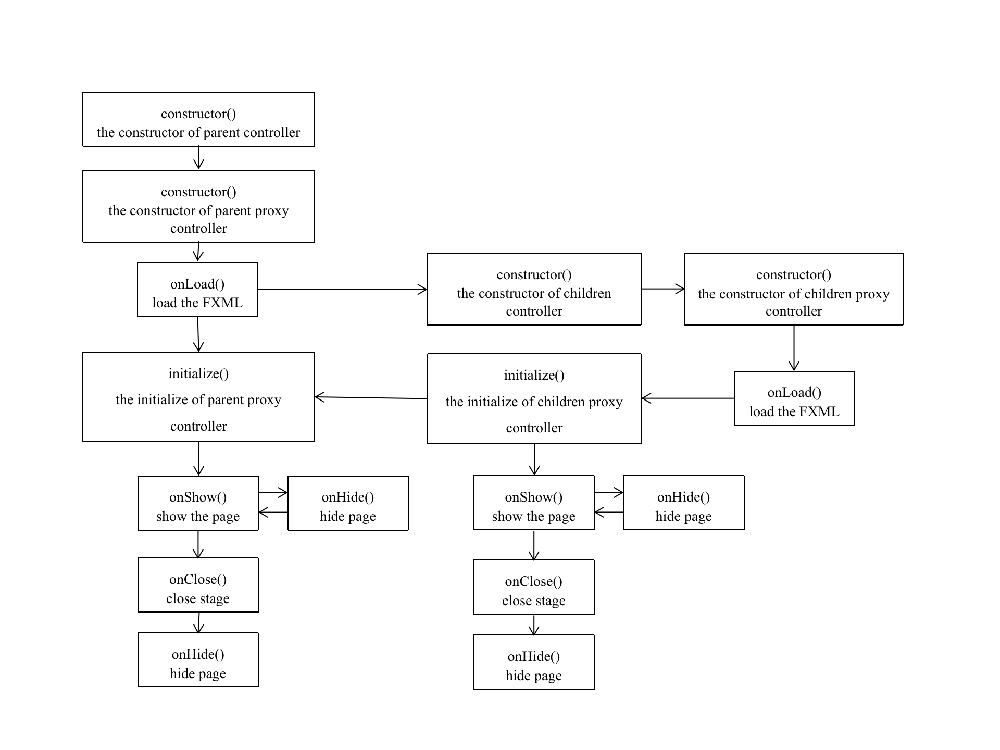
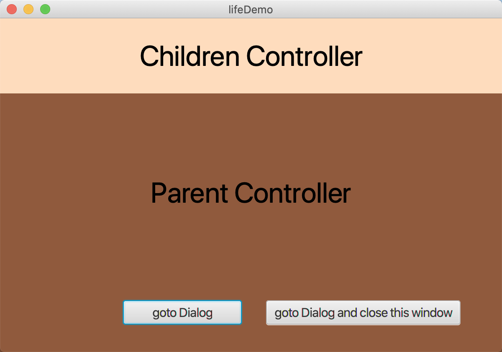
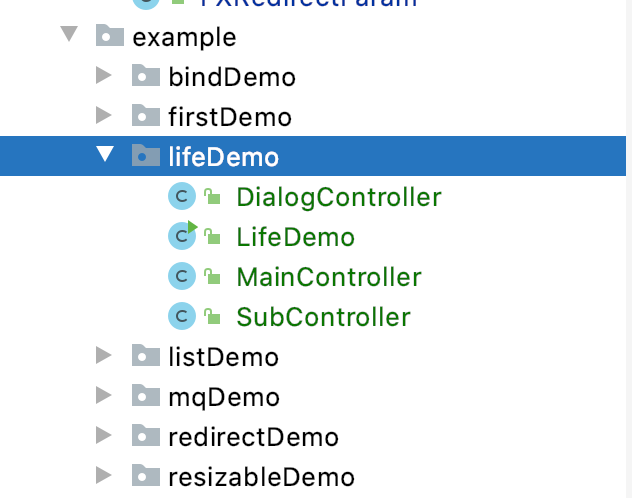
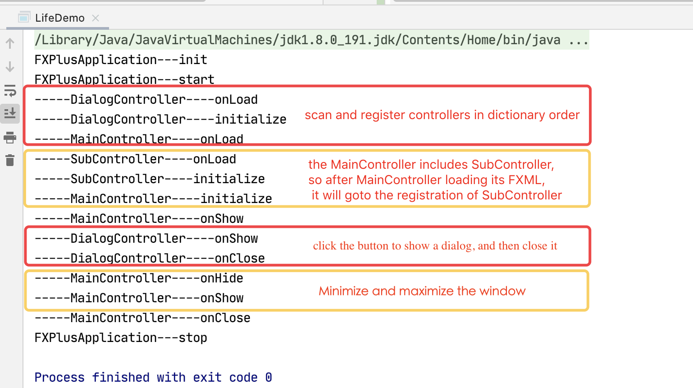

# JavaFX-Plus

Language:  [中文](README.md)

## Contents

[Introduction](#introduction)

- [The Process of Developing](#the-process-of-developing)

[Maven Repository](#maven-repository)

[Git](#git)

[The Specific Application with JavaFX-Plus](#the-specific-application-with-javafx-plus)

[The Detailed Functions of JavaFX-Plus](#the-detailed-functions-of-javafX-plus)

- [Modularization Development](#modularization-development)
  - [Introduction](#introduction-of-modularization)
  - [How to Create the Module of JavaFX-Plus](#how-to-create-the-module-of-javafX-plus)
  - [Import the control just generated above in SceneBuilder](#import-the-control-just-generated-above-in-scenebuilder)
- [Integration with Spring](#integration-with-spring)
- [Log](#log)
  - [Introduction](#log-introduction)
  - [How to use](#how-to-use)
  - [Result](#result)
- [Life Cycle](#life-cycle)
  - [Introduction](#introduction-of-life-cycle)
  - [The life cycle of multiple controllers](#the-life-cycle-of-multiple-controllers)
  - [Example](#example)
- [Signal Mechanism](#signal-mechanism)
- [The conversion of JavaBean and JavaFXBean](#the-conversion-of-javabean-and-javafxbean)
- [Pluggable function](#pluggable-function)
- [Data Binding](#data-binding)
  - [The binding between bean and view](#the-binding-between-bean-and-view)
  - [The binding between view and view](#the-binding-between-view-and-view)
  - [The binding of functional expression](#the-binding-of-functional-expression)
  - [Multi-window switching](#multi-window-switching)
    - [Introduction](#introduction)
    - [Related Annotations](#related-annotations)
    - [Specification](#specification)
    - [How to Use](#usage-of-multi-window-switching)
    - [Example Code](#example-code)
  - [Internationalization and localization](#internationalization-and-localization)

[How to Use JavaFX-Plus](#how-to-use-javafX-plus)

- [Code Template](#code-template)
  - [JavaFXPlusApplication](#JavaFXPlusApplication)
  - [JavaFXPlusWindow](#JavaFXPlusWindow)
  - [JavaFXPlusController](#JavaFXPlusController)
  - [JavaFXPlusFXML](#JavaFXPlusFXML)

- [Annotations](#annotations)

- [Two Factories and A Context](#two-factories-and-a-context)

[Start your first JavaFX-Plus Application](#start-your-first-javafx-plus-application)

[Update List](#update-list)

## Introduction

The framework is not the framework for beautifying UI, but to simplify the step of developing the JavaFX Application and reduce the component coupling. Precently, the main functions of our framework are shown as follows: 


### The Process of Developing

Our project has suspended update from Nov. 25, 2019, and the next release will be updated to 2.0. We try to provides more data binding operations and optimize performance.

- [x] Modularization
- [x] Integration with Spring
- [x] Signal Mechanism
- [x] The conversion of JavaBean and JavaFXBean
- [x] Pluggable function (drag window, etc.)
- [x] Data Binding
  - [x] The binding between bean and view
  - [x] The binding between view and view
  - [x] The binding of functional expression
- [x] Multi-window switching
- [ ] The binding of event annotation
- [ ] The binding of keyboard events
- [ ] Data valication
- [ ] Optimize performance

## Maven Repository

```xml
<dependency>
  <groupId>com.gitee.Biubiuyuyu</groupId>
  <artifactId>javafx-plus</artifactId>
  <version>1.0.0-RELEASE</version>
</dependency>
```

## Git

```
Github		https://github.com/BillKiller/JavaFX-Plus.git
Gitee		https://gitee.com/Biubiuyuyu/JavaFX-Plus.git
```


## The Specific Application with JavaFX-Plus

Available from this:  [Paper Loader](https://gitee.com/Biubiuyuyu/JavaFX-Demo 'Demo')

## The Detailed Functions of JavaFX-Plus

### Modularization Development

#### Introduction of modularization

Generally, many of the interfaces are similar or duplicate in the development of JavaFX application. Therefore it would be much more efficient to package these interfaces into custom controls that can be dragged from SceneBuilder. We propose to divide different interfaces into different sub-modules to reduce coupling and accelerate parallel development. For example, we always divide the interface into the top toolbar, the navigation bar on the left, and the internal bar on the right. If everything is written in one controller, it will cause a lot of bloat, so we want to divide different interfaces and manage them separatelly.


#### How to Create the Module of JavaFX-Plus

- Just new a class extends `FXBaseController` class, and this new class is what we always called Controlelr. The `FXBaseController` extends `Pane` class, and that is the idea behind JavaFX-Plus: Everything is Pane. 
- Label this controller with an annotation of `@FXController`, providing the address of FXML file.
- If we want to show the controller into a separate window, we can add a class annotation of `@FXWindow` to label it, with the value of "title" marking the title of the window and "mainStage" marking that if this window is shown as a main stage while starting the application.

The example is shown as follows, which we can get it is easier for us to develop a simple JavaFX application.


#### Import the control just generated above in SceneBuilder 


###  Integration with Spring

The framework can quickly support integration with Spring, and with one line of code, it can inverse control of instance generation to Spring container management.

The example is shown as follows:

```java
@FXScan(base = {"cn.edu.scau.biubiusuisui.example.springDemo"})
public class SpringDemo extends Application {
    @Override
    public void start(Stage primaryStage) throws Exception {
        ApplicationContext context = new ClassPathXmlApplicationContext("applicationContext.xml"); //start spring
        FXPlusApplication.start(SpringDemo.class, new BeanBuilder() {
            @Override
            public Object getBean(Class type) {
                return  context.getBean(type);
            }
        });
    }
}
```


### Log

#### Log Introduction

JavaFX-Plus integrates the log4j framework, performing log processing, which can control the delivery of log information. Additionally, it can be flexibly configured through the configuration file` log4j.properties`, so that developers can quickly locate abnormal errors in development processes.

For the Maven project, log4j's configuration file `log4j.properties` or `log4j.xml` is placed in the resources folder by default (as shown below). If the file path does not match, you need to set it in the code separately, otherwise log4j will not start normally. Prompt file not existed.




#### How to use

1. Processing of log4j.properties

   - The sample code of log4j.properties is as follows, JavaFX-Plus default DEBUG and ERROR level logs will be output to the current directory `logs/debug/javafxplus.log` and ` logs/debug/javafxplus.log`

     ```properties
     ### setting###
     log4j.rootLogger=debug,stdout,D,E
     ### print log message to console###
     log4j.appender.stdout=org.apache.log4j.ConsoleAppender
     log4j.appender.stdout.Target=System.out
     log4j.appender.stdout.layout=org.apache.log4j.PatternLayout
     log4j.appender.stdout.layout.ConversionPattern=[%-5p] %d{yyyy-MM-dd HH:mm:ss,SSS} [%t] [%c] - %m%n
     ### print debug log message to File=E://logs/error.log ###
     log4j.appender.D=org.apache.log4j.DailyRollingFileAppender
     ### Windowsy
     #log4j.appender.D.File = E://logs/debug/log.log
     # MacOS
     log4j.appender.D.File=${log.base}/logs/debug/javafxplus.log
     log4j.appender.D.Append=true
     log4j.appender.D.Threshold=DEBUG 
     log4j.appender.D.layout=org.apache.log4j.PatternLayout
     log4j.appender.D.layout.ConversionPattern=[%p] %-d{yyyy-MM-dd HH:mm:ss}  [%t] [%l] - %m%n
     ###  print error log message to File=E://logs/error.log ###
     log4j.appender.E=org.apache.log4j.DailyRollingFileAppender
     ### Windows
     #log4j.appender.E.File = E://logs/error/log.log
     # MacOS
     log4j.appender.E.File=${log.base}/logs/error/javafxplus.log
     log4j.appender.E.Append=true
     log4j.appender.E.Threshold=ERROR 
     log4j.appender.E.layout=org.apache.log4j.PatternLayout
     log4j.appender.E.layout.ConversionPattern=[%p] %-d{yyyy-MM-dd HH:mm:ss}  [%t] [%l] - %m%n
     ```

   - Configure the output path of the log dynamically

     In log.properties, `$ {log.base}` represents system variables, which can be customized. By default, JavaFX-Plus takes the current project path as the value of` log.base`. But you can also use the method `initLog4jBase(String base)` provided by the `LogUtil` class of JavaFX-Plus, where base is the value of` log.base`.

   

2. wo ways to print logs

   - Through the ` getLogger()` method of FXPlusLoggerFactory, passing in the Class of the current class to get IFXPlusLogger, and then you can print the log by provided methods like  `info`, ` debug`, `error` and other methods.

   - Use LogUtil's static methods like `info`, ` debug`,  `error`, etc. to print logs.

     ```java
     public class LogDemo {
         private static IFXPlusLogger logger = FXPlusLoggerFactory.getLogger(LogDemo.class);
         
         public void testLogger() {
             logger.info("info");
             logger.error("error");
             logger.debug("debug");
             logger.warn("warn");
         }
         public void testLogUtil() {
             LogUtil.info("info");
             LogUtil.error("error");
             LogUtil.debug("debug");
             LogUtil.warn("warn");
         }
         public static void main(String[] args) {
             LogDemo demo = new LogDemo();
             demo.testLogger();
             demo.testLogUtil();
         }
     }
     ```

#### Result

There are differences between the two ways to print the log. The class names of the two logs are different, but they can accurately locate a line of the log.

```verilog
[INFO ] 2020-05-03 01:22:40,165 [main] [cn.edu.scau.biubiusuisui.example.logDemo.LogDemo.testLogger(LogDemo.java:18)] - info
[ERROR] 2020-05-03 01:22:40,169 [main] [cn.edu.scau.biubiusuisui.example.logDemo.LogDemo.testLogger(LogDemo.java:19)] - error
[DEBUG] 2020-05-03 01:22:40,169 [main] [cn.edu.scau.biubiusuisui.example.logDemo.LogDemo.testLogger(LogDemo.java:20)] - debug
[WARN ] 2020-05-03 01:22:40,169 [main] [cn.edu.scau.biubiusuisui.example.logDemo.LogDemo.testLogger(LogDemo.java:21)] - warn
[INFO ] 2020-05-03 01:22:40,170 [main] [cn.edu.scau.biubiusuisui.example.logDemo.LogDemo.testLogUtil(LogDemo.java:25)] - info
[ERROR] 2020-05-03 01:22:40,170 [main] [cn.edu.scau.biubiusuisui.example.logDemo.LogDemo.testLogUtil(LogDemo.java:26)] - error
[DEBUG] 2020-05-03 01:22:40,173 [main] [cn.edu.scau.biubiusuisui.example.logDemo.LogDemo.testLogUtil(LogDemo.java:27)] - debug
[WARN ] 2020-05-03 01:22:40,173 [main] [cn.edu.scau.biubiusuisui.example.logDemo.LogDemo.testLogUtil(LogDemo.java:28)] - warn
```

### Life Cycle

JavaFX Applications have their life cycle, and our JavaFX-Plus refers to the life cycle of WeChat Miniprogram and Vue.js. Based on the life cycle of native JavaFX, a series of actions from JavaFX Application startup to JavaFXController initilization and registration. We provided empty implementations of several functions, such as: if you need to perform related operations before desiplaying the page, you can rewrite `onShow`  method to perform related operation in body. The example demo of life cycle has shown in  `cn.edu.scau.biubiusuisui.example.lifeDemo`.

#### Introduction of life cycle

Firstly, we'll show you the life cycle of JavaFX-Plus:

- **`launch()`**: The native static method of JavaFX, launching the JavaFX Application independently, which can not be rewritten.

- **`init()`**:  The function to initialize the JavaFX Application, being revoked after `launch()`. The method can be rewritten, which is convenient to initialize the application before its startup. But this method is not UI thread, and any UI operations can not be performed here.

- **`start()`**: The main entrance to all JavaFX Applications. When the init method is executed, the start method will be called. And this method is a JavaFX Application thread and UI operations can be performed here.

- **`stop()`**: When the JavaFX application is stopped, the method will be executed first to facilitate the destruction of related resources at the end of the application. This method is a JavaFX Application thread and UI operations can be performed here.

- **`constructor()`**: Constructor is not an actual function, here refers to the constructor of JavaFX Controller.

- **`onLoad`**: Monitor the loading of FXML pages, and call it before the loading. The application can rewrite this method to perform related operations before loading the FXML page, which is only triggered sonce globally.

- **`initialize()`**: The initialization method called after the page is loaded. The application can rewrite this method. It is generally used to initialize the initial values of some controls before displaying the page. It is only triggered once globally.

- **`onShow()`**: Monitor the display of the page and call it before the page is displayed. The application can override this method to facilitate related data processing and other operations before displaying the page.
- **`onHide()`**: The application can override this method to monitor the operation of page hiding or from foreground to background.

- **`onClose()`**: Monitor the closing of the page, such as the close button of the window title bar, stage.close () and other methods to call before closing, the application can override this method.




​	Additional notes:

​	(1) The hidden pages we know are minimized windows, but `stage.hide()` and `stage.close() `are equivalent in the official JavaFX documentation, so developers need to pay attention when using these two native methods. JavaFX API documentation: http://docs.oracle.com/javafx/2/api/javafx/stage/Stage.html#close()

​	(2) By default, the JavaFX application will automatically exit after the last Stage is closed, that is, automatically call `Application.stop()`. If you need to cancel this default operation, you can set `Platform.setImplicitExit(false)`, which can be used for some programs that can still run in the background after closing the desktop page, such as download background.


#### The life cycle of multiple controllers

When there are multiple Controllers in the JavaFX-Plus program, firstly the JavaFX-Plus will scan and register in the dictionary order according to the package of the attribute value of the `FXScan` annotation, when another Controller (child component) is referenced in a Controller (parent component), after the parent component loads the FXML page, it will enter the initialization process of the child component. Just after the child component completes `initialize()`, it will return to execute the parent component's `initialize()`.



#### Example

1. By running `cn.edu.scau.biubiusuisui.example.lifeDemo`, relevant information will be printed out in Console.

   


2. The component composition is as follows. The parent component contains child components. The parent component can also pop up a set window through the button.

   

   

   3. First, by default, under the package marked by the base attribute of the `@FXScan` annotation in FXPlusApplication (LifeDemo in this example), scanning and registering in dictionary order. After registering DialogController, when registering MainController, because its FXML file refers to SubController, so after MainController executes the loading of FXML, it will jump to the registration process of SubController, and then return to `initialize()` of MainController.

   

   

   Then, when the popup button is clicked, DialogController's `showStage()` is called. At this time, the `onShow` is triggered. Click the close button to trigger the ` onClose`. When minimized and maximized the window, `onHide` and` onShow` are triggered respectively.




###  Signal Mechanism

There are two annotations, one is `@FXSender`, which is applied to a method, marking this method as the signal emission method. And we can change the name of this emitting function with the value of "name", which default name is the method name. 

The emitting signal will be received by all FXReceiver that subsrcibe to the emitting function, and the return value of the emitting function is passed into the FXReceiver function as a parameter. This sending and receiving relationship is global and can be recevied by any registered controller, not limited to the same controller.

Let's take an example of the implementation of custom compoent navigation top bar, be contained in the main interface. When the user clicks some buttons in the navigation bar, the bar can return information relating the main interface. The example fxml file is shown in the `mqDemo` folder under resources.


1. With the modularity of JavaFX, we designed a simple navigation bar: 

```java
@FXController(path = "fxml/mqDemo/topBar.fxml")
public class TopBarController extends FXBaseController {
    @FXML
    public void indexClick() {
        sendToMain("Click [Index]");
    }
    @FXML
    public void scoreClick() {
        sendToMain("Click [Score Center]");
    }
    @FXML
    public void questionClick() {
        sendToMain("Click [Answer Center]");
    }
    @FXML
    public void selfClick() {
        sendToMain("Click [Personal Center]");
    }

    /**
     * The application will invoke all methods which subscrib the signal.
     * @param msg
     * @return
     */
    @FXSender   //Marks this method as a signal emission method
    public String sendToMain(String msg) {
        return msg;
    }
}
```


2. Then we designed a main page, which contains the navigation bar.

```java
@FXController(path = "fxml/mqDemo/main.fxml")
@FXWindow(mainStage = true, title = "MQDemo")
public class MainController extends FXBaseController {

    @FXML
    private TextArea outTA;

    /**
     * The name of subscribed signal should be: [FXSenderName:MethodName]
     * The return value of signal emission method will be injected as parameter to signal received method
     *
     * @param msg
     */
    @FXReceiver(name = "TopBarController:sendToMain")
    public void handleTopBar(String msg) {
        // TODO: 2019/12/8
        // Handle the mouse click event of navigation bar
        outTA.appendText(msg + "\n");
    }
}
```


### The conversion of JavaBean and JavaFXBean

Generally, we write Java beans of basic types, but the design philosophy of JavaFX beans is that these properties should be `Property` types defined by JavaFX, which is very bad for our development. So how can we use some good methods for JavaFX properties without changing Java beans? The answer is that by reflection we can get the Property corresponding to the primitive type, but currently limited to boolean, double, integer, long, string, float, List, etc.


We hope we can avoid methods which directly operate on Property related to interfaces during the development, but directly operate on Java bean classes. The example is shown as follows:

```java
@FXController(path = "fxml/Main.fxml")
@FXWindow(title = "demo1")
public class MainController extends FXBaseController{

    @FXML
    Button btn;

    @FXML
    Label label;
    
    Student student;

    int count = 1;

    @Override
    public void initialize() {
        // Get Student from FXEntityFactory
        student = (Student) FXEntityFactory.getInstance().createJavaBeanProxy(Student.class);
        student.setName("Jack"); // Set name for Student
        FXEntityProxy fxEntityProxy = FXPlusContext.getProryByBeanObject(student); //Get the proxy for Student
        Property nameProperty = fxEntityProxy.getPropertyByFieldName("name"); //Get corresponding Property
        //We can get the Property for List through fxEntityProxy.getPropertyByFieldName("list");
        label.textProperty().bind(nameProperty); //bind to property
    }

    @FXML
    @FXSender
    public String send(){
        student.setName("Jack :" + count);
        count++;
        return "sending msg";
    }

}
```


```java
@FXEntity
public class Student {
    @FXField
    private String name; //Mark a field to be converted to Property field
    
    private int age;
    private  String gender;
    private  String code;

    @FXField
    private List<String> list = new ArrayList<>();

    public String getName() {
        return name;
    }
    
    // setter & getter
    //  ...

    public void addList(String word){
        list.add(word);
    }
    public void delList(String word){
        list.remove(word);
    }
}
```

The result show us as follows:


We directly operate on Java bean classess, modifying the interface with dynamic binding. And we don't need to convertJava bean to JavaFX bean, which reduce type conversion in development.

###  Pluggable function

In our framework, windows are draggable and scalable. In JavaFX, if a window hides its title, the window can not be dragged and scaled. But in JavaFX-Plus, we have resolved this issue with an annotation of `@FXWindow`.

```java
@FXWindow(title = "demo1",dragable = true,style = StageStyle.UNDECORATED) //draggable
```

As described in the code above, you can make window with no title draggable and scalable( the default value is draggable).


```java
@FXWindow(title = "demo1",resizable = true,style = StageStyle.UNDECORATED) // resizable
```


### Data Binding

In this section, similar to interface binding in Vue, we use an annotation of `@FXBind`, which should be used on the field of JavaFX controls, marking the binding mode and properties of the marked field. Currently, we have implemented the binding between bean and view, between view and view, and the binding of functional expression. 


#### The binding between bean and view

As example shown follows, we binded the name of `Student` to the input text of `TextField`, and binded the password of `Student` to the input text of `PasswordField`, simplify the operation on data transmission. And there are no interface data transmission from interface to controller.

The example is shown as follows:

```java
@FXData
@FXBind(
    {
        "name=${usr.text}",
        "password=${psw.text}"
    }
	)
Student student = new Student();

@FXML
private PasswordField psw;

@FXML
private Label pswMsg;

@FXML
void login(ActionEvent event) {
    System.out.println("user:" + student.getName());
    System.out.println("psw:" + student.getPassword());
    if ("admin".equals(student.getName()) && "admin".equals(student.getPassword())) {
        System.out.println("Ok");
    } else {
        System.out.println("fail");
    }
}
```

The result of simple application as shown follows:


#### The binding between view and view

```java
@FXBind("text=${psw.text}")
@FXML
private Label pswMsg;//bind the text of Label(pswMsg) to psw
```

The result of simple application as shown follows:


#### The binding of functional expression

The example code is shown at `cn.edu.scau.biubiusuisui.example.listDemo` and  `cn.edu.scau.biubiusuisui.actionDemo`, now let's take an example of actionDemo.

1. How to use

As the two usage above, the annotation is used to mark on the controller class of the inteface, like the usage above, with `${}` as the external identifier. But if we bind to the functional expression, we need to put `@` before the name of the method.

```java
@FXBind("text=${@toUs(time.text)}") // bind the text of Label to the return value of toUs() function
private Label us;
```

2. Example code

As code shown follows, we implemented a simple exchange rate converter

```java
@FXController(path = "fxml/bindDemo/bindDemo.fxml")
@FXWindow(title = "fxml/bindDemo", mainStage = true)
public class MainController extends FXBaseController implements Initializable {
    @FXML
    @FXBind("text=${@toUs(time.text)}") // bind the text of Label to the return value of toUs() function
    private Label us;

    @FXML
    @FXBind("text=${@toJp(time.text)}")
    private Label jp;

    @FXML
    @FXBind("text=${@toUk(time.text)}")
    private Label uk;

    @FXML
    private TextField time;

    public String toUs(String value) {
        double money = Double.valueOf(value);
        double percent = 0.1454;
        return String.valueOf(money * percent);
    }

    public String toJp(String value) {
        double money = Double.valueOf(value);
        double percent = 15.797;
        return String.valueOf(money * percent);
    }

    public String toUk(String value) {
        double money = Double.valueOf(value);
        double percent = 0.1174;
        return String.valueOf(money * percent);
    }
}
```

3. The result of simple application as shown follows:


### Multi-window switching

#### Introduction

In JavaFX application, we always need to switch between multiple windows, such as the login window, click “login” and jump to the login success/fail window. The JavaFX tutorial on multi-window switching on the web is implemented as follows: binding FXML file in Controllers and the window can be switched through show() method. Since our framework already encapsulates the function to bind the FXML file, it is not practical to initialize the Stage and set parameters directly inside Controller. Therefore, in our framework, we design a class named StageController to manage Controllers.

#### Related Annotations

`@FXController`：Annotated on a class, to bind FXML file and mark this class as a control.

`@FXWindow`：Annotated on a class, to mark this class as a seperate window and it can be redirected only if it is marked as a seperate window.

`@FXRedirect`：Annotated on a method, to mark this method to handle redirection.

#### Specification

The JavaFX-Plus stipulates that if we need an annotated with `@FXRedirect` method to handle redirection, the return value must be Stirng property or FXRedirectParam class, which all should provide the name of registered Controller. For example, if we need redirecting to login success interface whose controller named SuccessController, we should write `return "SuccessController"` in the method handling redirection. But the way above had not transfer data to anothor stage. If we need to transfer data to anothor stage, we should return url or FXRedirectParam, the usage has follows:

#### Usage of Multi-window switching

1. The usage of annotation `FXRedirect` as shown follows:

   ```java
   @FXRedirect
   public String redirectToRegister() {
   	return "RegisterController";
   }
   
   @FXML
   @FXRedirect(close = false) //test popup
   public String redirectToDialog() {
   	return "DialogController";
   }
   
   @FXML
   @FXRedirect //redirect to success page with query url
   public String redirectToSuccessWithQuery() {
   	return "SuccessController?username=" + usernameTF.getText();
   }
   
   @FXML
   @FXRedirect //redirect to success page with param
   public FXRedirectParam redirectToSuccessWithParam() {
       //SuccessController is the name of controller which is redirected to 
       FXRedirectParam params = new FXRedirectParam("SuccessController"); 
       params.addParam("username", usernameTF.getText());
       return params;
   }
   
   @FXML
   @FXRedirect //redirect to success page with query and param
   public FXRedirectParam redirectToSuccessWithAll() {
       //SuccessController is the name of controller which is redirected to 
       FXRedirectParam params = new FXRedirectParam("SuccessController"); 
       params.addParam("username", usernameTF.getText());
       params.addQuery("token", new Date().toString());
       return params;
   }
   ```

   The boolean value of close marks that if close the current window, and the default value is true, which means that the current window will be closed when redirecting to anothor window.

    If we need to transform data to another controller when redirecting to it, we can choose to return URL string, for example  `return "SuccessController?name=JavaFX&password=Plus"`, or return class `FXRedirectParam` provided by JavaFX-Plus, with this way, we can choose addParam() or addQuery to transform parameters data according to your needs. 

2. Create the login Controller

   1. Firstly, we design an API of data which transforms from LoginController to SuccessController, which as follows:
   
      ```java
      username: the name of user to login
      password: the password of user to login
      token: a token to login
      ```
   
      The example code :
   
      ```java
      @FXController(path = "fxml/redirectDemo/login.fxml")
      @FXWindow(title = "fxml/redirectDemo", mainStage = true)
      public class LoginController extends FXBaseController {
          @FXML
          private TextField usernameTF;
          @FXML
          private PasswordField passwordPF;
          
          @FXML
          public void registerClick() { //click the "register" button
              redirectToRegister();
          }
      
          @FXRedirect
          public String redirectToRegister() { //redirect to register page
              return "RegisterController";
          }
      
          @FXML
          @FXRedirect(close = false) //popup
          public String redirectToDialog() {
              return "DialogController";
          }
      
          @FXML
          @FXRedirect //redirect to success page with query url
          public String redirectToSuccessWithQuery() {
              return "SuccessController?username=" + usernameTF.getText() + "&password=" + passwordPF.getText();
          }
      
          @FXML
          @FXRedirect //redirect to success page with param
          public FXRedirectParam redirectToSuccessWithParam() {
              FXRedirectParam params = new FXRedirectParam("SuccessController");
              params.addParam("username", usernameTF.getText());
              params.addParam("password", passwordPF.getText());
              return params;
          }
      
          @FXML
          @FXRedirect //redirect to success page with query and param
          public FXRedirectParam redirectToSuccessWithAll() {
              FXRedirectParam params = new FXRedirectParam("SuccessController");
              params.addParam("username", usernameTF.getText());
              params.addParam("password", passwordPF.getText());
              params.addQuery("token", new Date().toString());
              return params;
          }
      }
      ```
   
3. Design the Controller which will be redirected to.

   ```java
   @FXController(path = "fxml/redirectDemo/register.fxml")
   @FXWindow(title = "register")
   public class RegisterController extends FXBaseController {
       @FXML
       private TextField usernameTF;
   
       @FXML
       private TextField emailTF;
       
       @FXML
       private PasswordField passwordPF;
   
       @FXML
       private PasswordField confirmPasswordPF;
   
       @FXML
       public void registerClick() {
           if (validate()) { //validate(): validate that if a user can register
               UserEntity userEntity = new UserEntity();
               userEntity.setUsername(usernameTF.getText());
               userEntity.setPassword(passwordPF.getText());
               userEntity.setEmail(emailTF.getText());
               // TODO register
               redirectToRegisterSuccess(userEntity);
           }
       }
   
       @FXML
       public void loginClick() {
           redirectToLogin();
       }
   
       @FXRedirect
       public String redirectToLogin() {
           return "LoginController";
       }
   
       @FXRedirect
       public FXRedirectParam redirectToRegisterSuccess(UserEntity userEntity) {
           FXRedirectParam fxRedirectParam = new FXRedirectParam("SuccessController");
           fxRedirectParam.addParam("user", userEntity);
           return fxRedirectParam;
       }
   }
   ```

   ```java
   @FXController(path = "fxml/redirectDemo/dialog.fxml")
   @FXWindow(title = "Dialog")
   public class DialogController extends FXBaseController {
   }
   ```

4. When we redirect to another controller, we need to process the data. We can override the method of `onShow`  in FXBaseController, which will be revoked before the revoke of `showStage()`. FXBaseController includes `query` and `param` fields, which storage the transformed data in the redirection.

   ```java
   @FXController(path = "fxml/redirectDemo/success.fxml")
   @FXWindow(title = "success")
   public class SuccessController extends FXBaseController implements Initializable {
       @FXML
       private Label title;
   
       @FXML
       private Label usernameLabel;
   
       @FXML
       private Label passwordLabel;
   
       @FXML
       private Label tokenLabel;
   
       @FXML
       @FXRedirect
       public String redirectToLogin() {
           return "LoginController";
       }
   
       @Override
       public void onShow() {
           if (this.getQuery().get("showType") != null) {
               String showType = (String) this.getQuery().get("showType");
               if (showType.equals("1")) { //register
                   title.setText("Register Success");
                   if (this.getParam().get("user") != null) {
                       UserEntity userEntity = (UserEntity) this.getParam().get("user");
                       usernameLabel.setText(userEntity.getUsername());
                       passwordLabel.setText(userEntity.getPassword());
                   }
               } else { //login ,username and password will be transformed with param
                   title.setText("Login Success");
                   if (this.getParam().size() > 1) {
                       usernameLabel.setText(String.valueOf(this.getParam().get("username")));
                       passwordLabel.setText(String.valueOf(this.getParam().get("password")));
                   }
               }
           }
       }
   }
   ```

#### Example Code

The example code is stored at `cn.edu.scau.biubiusuisui.example.redirectDemo`, and the FXML file is stored in redirectDemo folder under resources.

1. redirect to anothor window(close the current window)


2. popup an window as a dialog(do not close the current window)


3. redirect to another window with data


### Internationalization and localization

#### Module Introduction

JavaFX natively supports internationalization and localization, through ResourceBundle and language configuration file xxx_zh_CN.properties for internationalization and localization operations. Because JavaFX-Plus encapsulates the loading of FXML files, and internationalization and localization operations need to be configured when the FXML files are loaded, JavaFX-Plus provides an interface for developers.

#### Usage

##### FXPlusLocale and annotatians

First of all, JavaFX-Plus provides the FXPlusLocale enumeration type in order to set multiple languages, and currently provides common languages such as simplified Chinese and traditional Chinese, as follows:

```java
public enum FXPlusLocale {
    // 不设置
    NONE,

    // 简体中文
    SIMPLIFIED_CHINESE,

    // 繁体中文
    TRADITIONAL_CHINESE,

    // English          英语
    ENGLISH,

    // American         美语
    AMERICAN,

    // Le français      法语
    FRANCE,

    // Deutsch          德语
    GERMANY,

    // lingua italiana  意大利语
    ITALIAN,

    // 日本人            日语
    JAPANESE,

    // 한국어            韩语   
    KOREAN,
}
```

When an FXController needs to be internationalized and localized, you need to add the attribute `locale` in the `@FXContorller `, whose type is `FXPlusLocale`, as follows:

```java
@FXWindow(mainStage = true, title = "languageDemo")
@FXController(path = "fxml/languageDemo/languageDemo.fxml", locale = FXPlusLocale.SIMPLIFIED_CHINESE)
public class ChineseController extends FXBaseController {
    @FXML
    public void clickToOtherLanguage() {
        redirect();
    }

    @FXRedirect
    public String redirect() {
        return "EnglishController";
    }
}
```

```java
@FXWindow(mainStage = false, title = "languageDemo")
@FXController(path = "fxml/languageDemo/languageDemo.fxml", locale = FXPlusLocale.ENGLISH)
public class EnglishController extends FXBaseController {
    @FXML
    public void clickToOtherLanguage() {
        redirect();
    }

    @FXRedirect
    public String redirect() {
        return "ChineseController";
    }
}
```

Both FXControllers are bound to the same FXML file. When the view changes, there is no need to change multiple FXML files in different languages, just add the locale attribute to the `@FXController` in the corresponding Controller, mark its language, and Use some click events to jump to pages in different languages.


##### FXML

JavaFX-Plus refers to the same syntax as JavaFX. In FXML's label attributes such as `text`,` label`, etc., use `%` to mark in front of a variable. This character variable should be parsed with international resources.

```xml
<Button mnemonicParsing="false" text="%register"/>
<Text strokeType="OUTSIDE" strokeWidth="0.0" text="%register.email"/>
```

The name of the marked variable must be defined in the properties file, otherwise a LoadException exception will occur when loading FXML. If `register1` in FXML with the label `%register1` is not defined, the following exception information will be reported:

```
Caused by: java.lang.RuntimeException: javafx.fxml.LoadException: Resource "register1" not found.
```


##### properties configuration

The compilation of the Properties resource file is strictly in accordance with its grammar, as follows: 

```properties
# English
register=Register
register.username=Username
register.password=password
register.confirmPassword=Confirm Password
register.phone=Phone
register.email=Email
```

It should be noted that the properties files must be ISO-8859-1 encoded, so for all non-Western language processing, they must first be converted to Java Unicode Escape format, otherwise ResourceBundle reading will be garbled. So we need conversion method which through the native2ascii tool that comes with JDK. Write the following command in the console to convert the file to unicode encoding.

```shell
native2ascii languageDemo_zh_CN.properties languageDemo_zh_CN.properties 
native2ascii languageDemo_ko.properties languageDemo_ko.properties 
```

Conversion result: 

```properties
# 中文
register=\u6ce8\u518c
register.username=\u7528\u6237\u540d
register.password=\u5bc6\u7801
register.confirmPassword=\u786e\u8ba4\u5bc6\u7801
register.phone=\u624b\u673a
register.email=\u90ae\u7bb1
```


#### Example

The sample code is in `cn.edu.scau.biubiusuisui.example.languageDemo`, the running result as follows:


All the above languages except Chinese are from Google Translate.


##  How to Use JavaFX-Plus

### Code Template

In order to facilitate developers to quickly generate code specifications that conform to JavaFX-Plus, a code template is specially designed, which can be imported in the IDE.

#### JavaFXPlusApplication

Generate code of the main entrance of JavaFX-Plus Application, the extension of file is java.

```java
#if (${PACKAGE_NAME} && ${PACKAGE_NAME} != "") package ${PACKAGE_NAME};#end

import cn.edu.scau.biubiusuisui.annotation.FXScan;
import cn.edu.scau.biubiusuisui.config.FXPlusApplication;
import javafx.application.Application;
import javafx.stage.Stage;

#parse("File Header.java")
@FXScan(base = "${PACKAGE_NAME}")
public class ${NAME} extends Application {
    @Override
    public void start(Stage primaryStage) throws Exception {
        FXPlusApplication.start(getClass());
    }
}
```


#### JavaFXPlusWindow

Generate code of a window in JavaFX-Plus Application, the extension of file is java.

```java
#if (${PACKAGE_NAME} && ${PACKAGE_NAME} != "") package ${PACKAGE_NAME};#end

import cn.edu.scau.biubiusuisui.annotation.FXWindow;
import cn.edu.scau.biubiusuisui.annotation.FXController;
import cn.edu.scau.biubiusuisui.entity.FXBaseController;

#parse("File Header.java")
@FXWindow(mainStage = true, title = "")
@FXController(path = "")
public class ${NAME} extends FXBaseController {
    
}
```


#### JavaFXPlusController

Generate code of a controller in JavaFX-Plus Application, the extension of file is java.

```java
#if (${PACKAGE_NAME} && ${PACKAGE_NAME} != "") package ${PACKAGE_NAME};#end

import cn.edu.scau.biubiusuisui.annotation.FXController;
import cn.edu.scau.biubiusuisui.entity.FXBaseController;

#parse("File Header.java")
@FXController(path = "")
public class ${NAME} extends FXBaseController {
    
}
```


#### JavaFXPlusFXML

Generate code of FXML file in JavaFX-Plus Application, the extension of file is xml.

```java
<?xml version="1.0" encoding="UTF-8"?>
<?import javafx.scene.layout.Pane?>

<fx:root maxHeight="-Infinity" maxWidth="-Infinity" minHeight="-Infinity" minWidth="-Infinity" prefHeight="400.0"
         prefWidth="600.0" type="Pane" xmlns="http://javafx.com/javafx/8.0.171" xmlns:fx="http://javafx.com/fxml/1">
         
</fx:root>
```


###  Annotations

| Name          | Usage                                                        | Parameter                                                    | Remark for Parameter                                         |
| ------------- | ------------------------------------------------------------ | ------------------------------------------------------------ | ------------------------------------------------------------ |
| @FXData       | in the controller, to mark a Java bean which is a field of controller, and it will be converted to JavaFX bean | fx_id                                                        | not necessary, renames the Java bean                         |
| @FXScan       | to scan classes which marked by @FXEntity and @FXController  | base                                                         | not necessary, marks a directory to scan all classes and the default value is current directory |
| @FXController | to mark a class as a control                                 | path                                                         | necessary, marks the path of FXML file                       |
| @FXWindow     | to mark a control to be displayed as a separate window       | 1. title<br>2. mainStage<br>3. preHeight, preWidth,minHeight, minWidth<br>4. resizable, draggable<br>5. style | 1. not necessary, marks the title of window<br>2. not necessary, the boolean value marks that if this window is main stage, default value is false<br>3. not necessary, marks the preHeight, preWidth, minHeight, minWidth for this window<br>4. not necessary, the boolean value marks that if this window is resizable or draggable<br>5. not necessary, marks the StageStyle for this window |
| @FXEntity     | to mark a Java bean which will be converted to JavaFX bean, and JavaFX-Plus will identify @FXField in it and package it to JavaFX bean |                                                              |                                                              |
| @FXField      | to mark a field in java bean marked by @FXEntity to be reflected to Property type |                                                              |                                                              |
| @FXSender     | to mark a method as sending signal method                    | name                                                         | not necessary, renames the signal                            |
| @FXReceiver   | to mark a method as receiving signal method                  | name                                                         | necessary, marks the subscribed signal                       |
| @FXRedirect   | to mark a method that can redirect to anthor window          | close                                                        | not necessary, the boolean value marks if close current window; the return value of this method should be the name of redrecting Controller or FXRedirectParam class. |

### Two Factories and A Context

1. Two Factories

In JavaFX-Plus, all Controller objects and FXEntity objects should be created through factories.

```java
student = (Student) FXEntityFactory.getInstance().wrapFxBean(Student.class); //New a Student through FXEntityFactory
```

The Java beans are created through the factory, and as they are created, the factory proxies the Java beans and wraps the corresponding Property properties.

```java
MainController mainController = (MainController)FXFactory.getFXController(MainController.class); 
```

2. A Context

The `FXPlusContext` stores all proxy classes for Controllers and FXEntities which annotated with `@FXController` and `@FXEntity`.

```java
public class FXPlusContext {
    private FXPlusContext(){}

    private static Map<String, List<FXBaseController>> controllerContext = new ConcurrentHashMap<>(); //a registry of FXController controllers

    private static Map<Object, FXEntityProxy> beanMap = new ConcurrentHashMap<>(); // register an Object to FXEntityObject

    public static void addController(FXBaseController fxBaseController){
        List<FXBaseController> controllers = controllerContext.get(fxBaseController.getName());
        if(controllers == null){
            controllers = new LinkedList<>();
        }
        controllers.add(fxBaseController);
    }

    public static List<FXBaseController> getControllers(String key){
        return controllerContext.get(key);
    }

    public static FXEntityProxy getProxyByBeanObject(Object object){
        return beanMap.get(object);
    }

    public static void setProxyByBeanObject(Object object,FXEntityProxy fxEntityProxy){
         beanMap.put(object,fxEntityProxy);
    }
}
```


##  Start your first JavaFX-Plus Application

1. New the main class.

```java
@FXScan(base = {"cn.edu.scau.biubiusuisui.example"}) // Scan classes annotated by @FXController and @FXEntity and initialize them
public class Demo extends Application {
    @Override
    public void start(Stage primaryStage) throws Exception {
        // Other paramters are same as the Application of original JavaFX
        // Here we invoke the start method of FXPlusApplication
        FXPlusApplication.start(Demo.class);
    }
}
```

2. Next, we design a FXML file and a controller class.

```java
@FXController(path = "fxml/Main.fxml")
@FXWindow(title = "demo1")
public class MainController extends FXBaseController{
    @FXML
    private ResourceBundle resources;
    @FXML
    private URL location;
    @FXML
    private Button addBtn;
    @FXML
    private Button delBtn;
    @FXML
    private ListView<String> list;

    Student student;

    @FXML
    void addWord(ActionEvent event) {
        student.addList("hello" );
    }

    @FXML
    void delWord(ActionEvent event) {
        student.delList("hello");
    }

    @Override
    public void initialize() {
        // Get the JavaFX bean which is wraped from Java bean in FXEntityFactory
        student = (Student) FXEntityFactory.wrapFxBean(Student.class);
        Property listProperty = FXPlusContext.getEntityPropertyByName(student, "list");
        list.itemsProperty().bind(listProperty);
    }
}

```

3. Now we design the Studen class.   

```java
@FXEntity
public class Student {

    @FXField
    private String name;

    @FXField
    private List<String> list = new ArrayList<>();

    public void addList(String word){
        list.add(word);
    }
    public void delList(String word){
        list.remove(word);
    }
}
```

It should be noted that, the root label of the FXML file must be `fx:root>`.

```xml
<?xml version="1.0" encoding="UTF-8"?>
<?import javafx.scene.control.Button?>
<?import javafx.scene.control.ListView?>
<?import javafx.scene.layout.Pane?>

<fx:root prefHeight="400.0" prefWidth="600.0" type="Pane" xmlns="http://javafx.com/javafx/8.0.171" xmlns:fx="http://javafx.com/fxml/1" fx:controller="cn.edu.scau.biubiusuisui.example.MainController">
   <children>
      <Button fx:id="addBtn" layoutX="432.0" layoutY="83.0" mnemonicParsing="false" onAction="#addWord" text="add" />
      <Button fx:id="delBtn" layoutX="432.0" layoutY="151.0" mnemonicParsing="false" onAction="#delWord" text="del" />
      <ListView fx:id="list" layoutX="42.0" layoutY="51.0" prefHeight="275.0" prefWidth="334.0" />
   </children>
</fx:root>
```

As example code shown above, it is less operation on operating interfaces, and objects we operated are containing basic type. It favors us to convert a normal Java project to a JavaFX project.

The result of our first simple application as shown follows:


## Update List

#### v1.0.0

1. Modularization Development
2. Integration with Spring
3. Signal Mechanism
4. The conversion of JavaBean and JavaFXBean
5. Pluggable function
6. Data Binding

#### v1.1.0

1. Add the function of multi-window switching.

#### v1.2.0

1. Design code template, and quickly generate FXPlusController, FXPlusWindow, FXPlusApplication, FXPlusFXML files that conform to the JavaFX-Plus programming specification after importing the IDE.
2. Improve the function of multi-window switching, which can redirect with data, see details：[Multi-window switching](#multi-window-switching).
3. Fix bugs caused by resizable and draggable attributes in `@FXWindow`.
4. Add an icon field to @FXWindow, passing in an icon URL of type String, which can add an icon to the window title bar.
5. Improve the life cycle of JavaFX-Plus.
6. Add a log module.
7. Add international and localization operation with resource budle.
8. Add the test life cycle LifeDemo example and LanguageDemo example.
9. Standardized code and updated README

