# JavaFX-Plus

## Contents

[Introduction](#Introduction)

- [The Process of Developing](#The Process of Developing)

[Maven Repository](#Maven Repository)

[The Specific Application with Java-Plus](#The Specific Application with Java-Plus)

[The Detailed Functions of JavaFX-Plus](#The Detailed Functions of JavaFX-Plus)

- [Modularization Development](#Modularization Development)
  - [Introduction](#Introduction)
  - [How to Create the Module of JavaFX-Plus](#How to Create the Module of JavaFX-Plus)
  - [Import the control just generated above in SceneBuilder](#Import the control just generated above in SceneBuilder)
- [Integration with Spring](#Integration with Spring)
- [Signal Mechanism](#Signal Mechanism)
- [The conversion of JavaBean and JavaFXBean](#The conversion of JavaBean and JavaFXBean)
- [Pluggable function](#Pluggable function)
- [Data Binding](#Data Binding)
  - [The binding between bean and view](#The binding between bean and view)
  - [The binding between view and view](#The binding between view and view)
  - [The binding of functional expression](#[The binding of functional expression])
  - [Multi-window switching](#[Multi-window switching])
    - [Introduction](#Introduction)
    - [Related Annotations](#[Related Annotations])
    - [Specification](#[Specification])
    - [How to Use](#[How to Use])
    - [Example Code](#[Example Code])
    - [Deficiencies](#Deficiencies)

[How to Use JavaFX-Plus](#How to Use JavaFX-Plus)

[Annotations](#Annotations)

[Two Factories and A Context](#Two Factories and A Context)

[Start your first JavaFX-Plus Application](#Start your first JavaFX-Plus Application)

## Introduction

The framework is not the framework for beautifying UI, but to simplify the step of developing the JavaFX Application and reduce the component coupling. Precently, the main functions of our framework are shown as follows: 

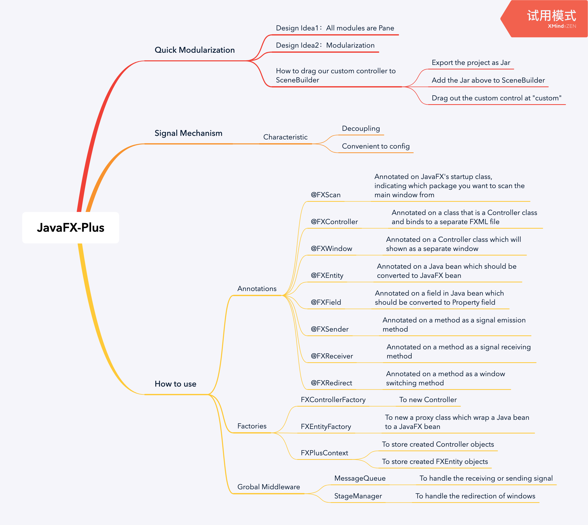


### The Process of Developing

Our project has suspended update from Nov. 25, 2019, and the next release will be updated to 2.0. We try to provides more data binding operations and optimize performance.

- [x] Modularization
- [x] Integration with Spring
- [x] Signal Mechanism
- [x] The conversion of JavaBean and JavaFXBean
- [x] Pluggable function (drag window, etc.)
- [x] Data Binding
  - [x] The binding between bean and view
  - [x] The binding between view and view
  - [x] The binding of functional expression
- [x] Multi-window switching
- [ ] The binding of event annotation
- [ ] The binding of keyboard events
- [ ] Data valication
- [ ] Optimize performance

## Maven Repository

```xml
<dependency>
  <groupId>com.gitee.Biubiuyuyu</groupId>
  <artifactId>javafx-plus</artifactId>
  <version>1.0.0-RELEASE</version>
</dependency>
```

## The Specific Application with Java-Plus

Available from this:  [Paper Loader](https://gitee.com/Biubiuyuyu/JavaFX-Demo 'Demo')

## The Detailed Functions of JavaFX-Plus

### Modularization Development

#### Introduction

Generally, many of the interfaces are similar or duplicate in the development of JavaFX application. Therefore it would be much more efficient to package these interfaces into custom controls that can be dragged from SceneBuilder. We propose to divide different interfaces into different sub-modules to reduce coupling and accelerate parallel development. For example, we always divide the interface into the top toolbar, the navigation bar on the left, and the internal bar on the right. If everything is written in one controller, it will cause a lot of bloat, so we want to divide different interfaces and manage them separatelly.


#### How to Create the Module of JavaFX-Plus

- Just new a class extends `FXBaseController` class, and this new class is what we always called Controlelr. The `FXBaseController` extends `Pane` class, and that is the idea behind JavaFX-Plus: Everything is Pane. 
- Label this controller with an annotation of `@FXController`, providing the address of FXML file.
- If we want to show the controller into a separate window, we can add a class annotation of `@FXWindow` to label it, with the value of "title" marking the title of the window and "mainStage" marking that if this window is shown as a main stage while starting the application.

The example is shown as follows, which we can get it is easier for us to develop a simple JavaFX application.

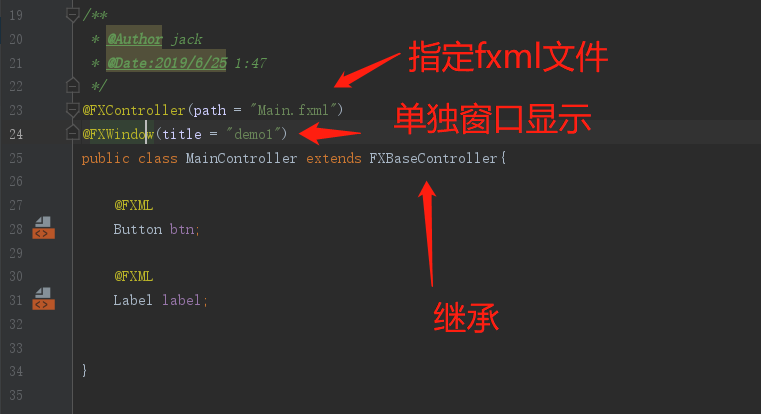


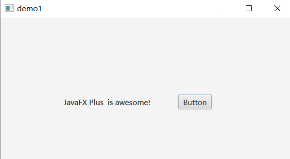


#### Import the control just generated above in SceneBuilder 


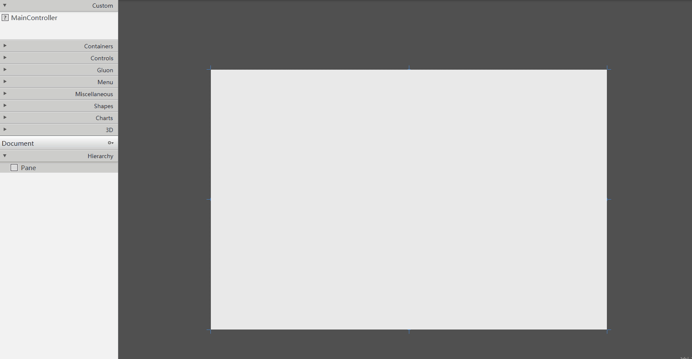


###  Integration with Spring

The framework can quickly support integration with Spring, and with one line of code, it can inverse control of instance generation to Spring container management.

The example is shown as follows:

```java
@FXScan(base = {"cn.edu.scau.biubiusuisui.example.springDemo"})
public class SpringDemo extends Application {
    @Override
    public void start(Stage primaryStage) throws Exception {
        ApplicationContext context = new ClassPathXmlApplicationContext("applicationContext.xml"); //start spring
        FXPlusApplication.start(SpringDemo.class, new BeanBuilder() {
            @Override
            public Object getBean(Class type) {
                return  context.getBean(type);
            }
        });
    }
}
```

###  Signal Mechanism

There are two annotations, one is `@FXSender`, which is applied to a method, marking this method as the signal emission method. And we can change the name of this emitting function with the value of "name", which default name is the method name. 

The emitting signal will be received by all FXReceiver that subsrcibe to the emitting function, and the return value of the emitting function is passed into the FXReceiver function as a parameter. This sending and receiving relationship is global and can be recevied by any registered controller, not limited to the same controller.

Let's take an example of the implementation of custom compoent navigation top bar, be contained in the main interface. When the user clicks some buttons in the navigation bar, the bar can return information relating the main interface. The example fxml file is shown in the `mqDemo` folder under resources.


1. With the modularity of JavaFX, we designed a simple navigation bar: 

```java
@FXController(path = "mqDemo/topBar.fxml")
public class TopBarController extends FXBaseController {
    @FXML
    public void indexClick() {
        sendToMain("Click [Index]");
    }
    @FXML
    public void scoreClick() {
        sendToMain("Click [Score Center]");
    }
    @FXML
    public void questionClick() {
        sendToMain("Click [Answer Center]");
    }
    @FXML
    public void selfClick() {
        sendToMain("Click [Personal Center]");
    }

    /**
     * The application will invoke all methods which subscrib the signal.
     * @param msg
     * @return
     */
    @FXSender   //Marks this method as a signal emission method
    public String sendToMain(String msg) {
        return msg;
    }
}
```


2. Then we designed a main page, which contains the navigation bar.

```java
@FXController(path = "mqDemo/main.fxml")
@FXWindow(mainStage = true, title = "MQDemo")
public class MainController extends FXBaseController {

    @FXML
    private TextArea outTA;

    /**
     * The name of subscribed signal should be: [FXSenderName:MethodName]
     * The return value of signal emission method will be injected as parameter to signal received method
     *
     * @param msg
     */
    @FXReceiver(name = "TopBarController:sendToMain")
    public void handleTopBar(String msg) {
        // TODO: 2019/12/8
        // Handle the mouse click event of navigation bar
        outTA.appendText(msg + "\n");
    }
}
```


### The conversion of JavaBean and JavaFXBean

Generally, we write Java beans of basic types, but the design philosophy of JavaFX beans is that these properties should be `Property` types defined by JavaFX, which is very bad for our development. So how can we use some good methods for JavaFX properties without changing Java beans? The answer is that by reflection we can get the Property corresponding to the primitive type, but currently limited to boolean, double, integer, long, string, float, List, etc.

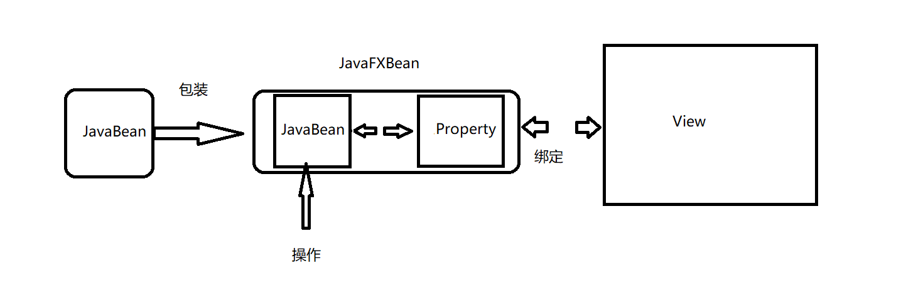

We hope we can avoid methods which directly operate on Property related to interfaces during the development, but directly operate on Java bean classes. The example is shown as follows:

```java
@FXController(path = "Main.fxml")
@FXWindow(title = "demo1")
public class MainController extends FXBaseController{

    @FXML
    Button btn;

    @FXML
    Label label;
    
    Student student;

    int count = 1;

    @Override
    public void initialize() {
        // Get Student from FXEntityFactory
        student = (Student) FXEntityFactory.getInstance().createJavaBeanProxy(Student.class);
        student.setName("Jack"); // Set name for Student
        FXEntityProxy fxEntityProxy = FXPlusContext.getProryByBeanObject(student); //Get the proxy for Student
        Property nameProperty = fxEntityProxy.getPropertyByFieldName("name"); //Get corresponding Property
        //We can get the Property for List through fxEntityProxy.getPropertyByFieldName("list");
        label.textProperty().bind(nameProperty); //bind to property
    }

    @FXML
    @FXSender
    public String send(){
        student.setName("Jack :" + count);
        count++;
        return "sending msg";
    }

}
```


```java
@FXEntity
public class Student {
    @FXField
    private String name; //Mark a field to be converted to Property field
    
    private int age;
    private  String gender;
    private  String code;

    @FXField
    private List<String> list = new ArrayList<>();

    public String getName() {
        return name;
    }
    
    // setter & getter
    //  ...

    public void addList(String word){
        list.add(word);
    }
    public void delList(String word){
        list.remove(word);
    }
}
```

The result show us as follows:

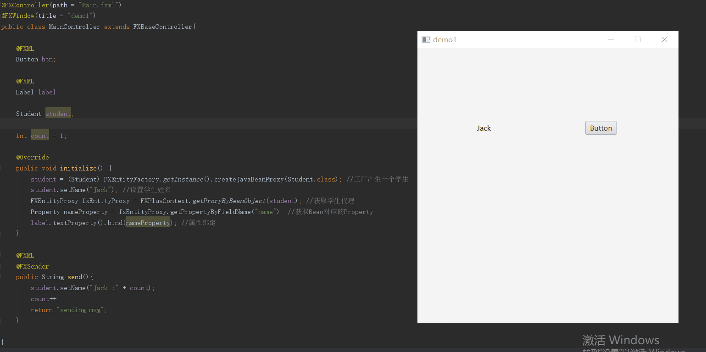


We directly operate on Java bean classess, modifying the interface with dynamic binding. And we don't need to convertJava bean to JavaFX bean, which reduce type conversion in development.

###  Pluggable function

In our framework, windows are draggable and scalable. In JavaFX, if a window hides its title, the window can not be dragged and scaled. But in JavaFX-Plus, we have resolved this issue with an annotation of `@FXWindow`.

```java
@FXWindow(title = "demo1",dragable = true,style = StageStyle.UNDECORATED)
```

As described in the code above, you can make window with no title draggable and scalable( the default value is draggable).

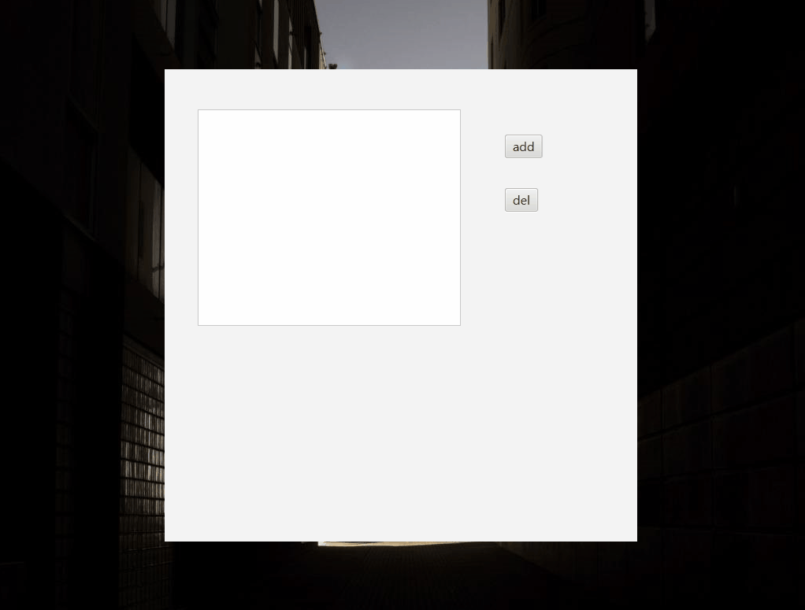


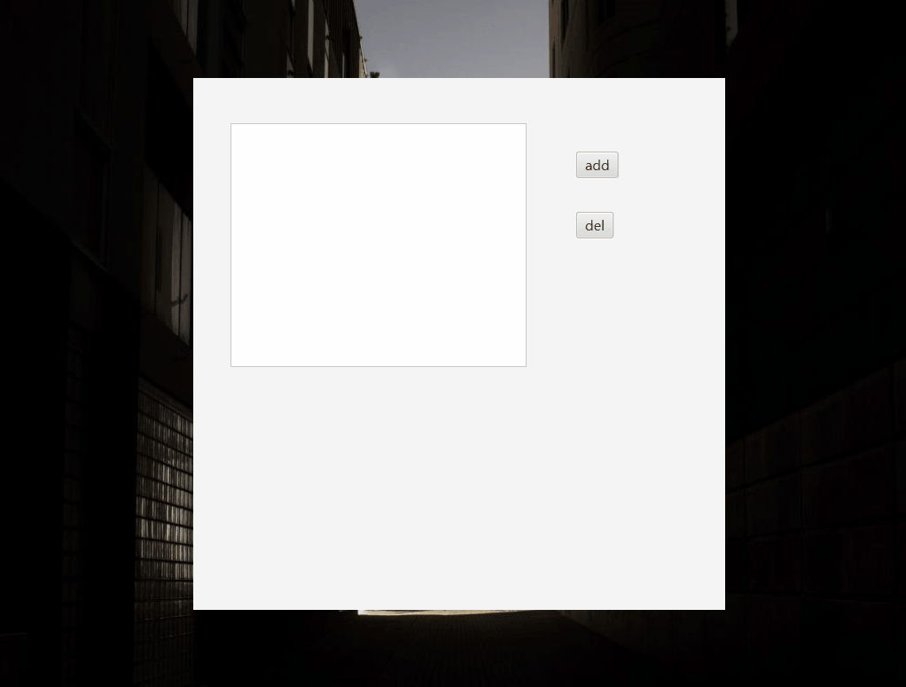

### Data Binding

In this section, similar to interface binding in Vue, we use an annotation of `@FXBind`, which should be used on the field of JavaFX controls, marking the binding mode and properties of the marked field. Currently, we have implemented the binding between bean and view, between view and view, and the binding of functional expression. 


#### The binding between bean and view

As example shown follows, we binded the name of `Student` to the input text of `TextField`, and binded the password of `Student` to the input text of `PasswordField`, simplify the operation on data transmission. And there are no interface data transmission from interface to controller.

The example is shown as follows:

```java
@FXData
@FXBind(
    {
        "name=${usr.text}",
        "password=${psw.text}"
    }
	)
Student student = new Student();

@FXML
private PasswordField psw;

@FXML
private Label pswMsg;

@FXML
void login(ActionEvent event) {
    System.out.println("user:" + student.getName());
    System.out.println("psw:" + student.getPassword());
    if ("admin".equals(student.getName()) && "admin".equals(student.getPassword())) {
        System.out.println("Ok");
    } else {
        System.out.println("fail");
    }
}
```

The result of simple application as shown follows:
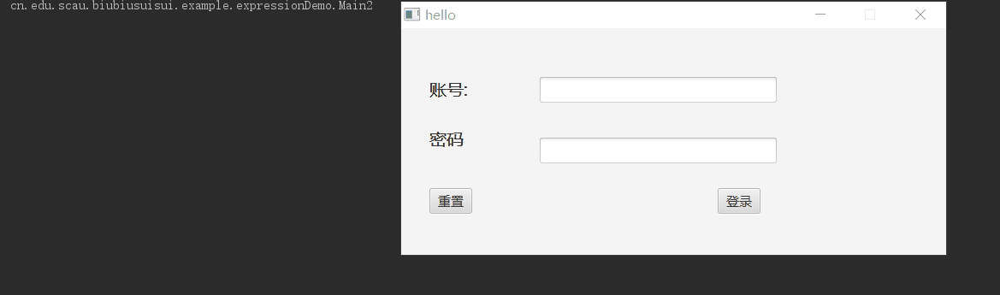


#### The binding between view and view

```java
@FXBind("text=${psw.text}")
@FXML
private Label pswMsg;//bind the text of Label(pswMsg) to psw
```

The result of simple application as shown follows:
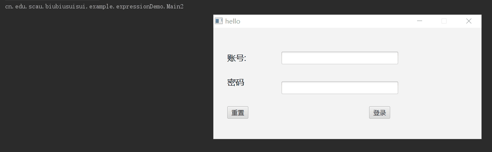


#### The binding of functional expression

The example code is shown at `cn.edu.scau.biubiusuisui.example.listDemo` and  `cn.edu.scau.biubiusuisui.actionDemo`, now let's take an example of actionDemo.

1. How to use

As the two usage above, the annotation is used to mark on the controller class of the inteface, like the usage above, with `${}` as the external identifier. But if we bind to the functional expression, we need to put `@` before the name of the method.

```java
@FXBind("text=${@toUs(time.text)}") // bind the text of Label to the return value of toUs() function
private Label us;
```

2. Example code

As code shown follows, we implemented a simple exchange rate converter

```java
@FXController(path = "actionDemo/actionDemo.fxml")
@FXWindow(title = "actionDemo", mainStage = true)
public class MainController extends FXBaseController implements Initializable {
    @FXML
    @FXBind("text=${@toUs(time.text)}") // bind the text of Label to the return value of toUs() function
    private Label us;

    @FXML
    @FXBind("text=${@toJp(time.text)}")
    private Label jp;

    @FXML
    @FXBind("text=${@toUk(time.text)}")
    private Label uk;

    @FXML
    private TextField time;

    public String toUs(String value) {
        double money = Double.valueOf(value);
        double percent = 0.1454;
        return String.valueOf(money * percent);
    }

    public String toJp(String value) {
        double money = Double.valueOf(value);
        double percent = 15.797;
        return String.valueOf(money * percent);
    }

    public String toUk(String value) {
        double money = Double.valueOf(value);
        double percent = 0.1174;
        return String.valueOf(money * percent);
    }
}
```

3. The result of simple application as shown follows:


### Multi-window switching

#### Introduction

In JavaFX application, we always need to switch between multiple windows, such as the login window, click “login” and jump to the login success/fail window. The JavaFX tutorial on multi-window switching on the web is implemented as follows: binding FXML file in Controllers and the window can be switched through show() method. Since our framework already encapsulates the function to bind the FXML file, it is not practical to initialize the Stage and set parameters directly inside Controller. Therefore, in our framework, we design a class named StageController to manage Controllers.

#### Related Annotations

`@FXController`：Annotated on a class, to bind FXML file and mark this class as a control.

`@FXWindow`：Annotated on a class, to mark this class as a seperate window and it can be redirected only if it is marked as a seperate window.

`@FXRedirect`：Annotated on a method, to mark this method to handle redirection.

#### Specification

The JavaFX-Plus stipulates that if we need an annotated with `@FXRedirect` method to handle redirection, the return value must be Stirng property and return the name of registered Controller. For example, if we need redirecting to login success interface whose conttroller named SuccessController, we should write `return "SuccessController"` in the method handling redirection.

#### How to Use

1. The usage of annotation `FXRedirect` as shown follows:

   ```java
       @FXRedirect
       public String redirectToRegister() {
           return "RegisterController";
       }
   
       @FXML
       @FXRedirect(close = false)
       public String redirectToDialog() {
           return "DialogController";
       }
   ```

   The boolean value of close marks that if close the current window, and the default value is true, which means that the current window will be closed when redirecting to anothor window.

2. Create the login Controller

   ```java
   @FXController(path = "redirectDemo/login.fxml")
   @FXWindow(title = "redirectDemo", mainStage = true)
   public class LoginController extends FXBaseController {
   
       @FXML
       private TextField usernameTF;
   
       @FXML
       private PasswordField passwordPF;
   
       @FXML
       public void registerClick() {
           redirectToRegister();
       }
   
       @FXRedirect
       public String redirectToRegister() {
           return "RegisterController";
       }
   
       @FXML
       @FXRedirect(close = false)
       public String redirectToDialog() {
           return "DialogController";
       }
   }
   
   ```
   
3. Design the Controller which will be redirected to.

   ```java
   @FXController(path = "redirectDemo/register.fxml")
   @FXWindow(title = "register")
   public class RegisterController extends FXBaseController {
       @FXML
       private TextField usernameTF;
       @FXML
       private TextField emailTF;
       @FXML
       private PasswordField passwordPF;
   
       @FXML
       private PasswordField confirmPasswordPF;
   
       @FXML
       public void registerClick() {
   
       }
   
       @FXML
       public void loginClick() {
           redirectToLogin();
       }
   
       @FXRedirect
       public String redirectToLogin() {
           return "LoginController";
       }
   }
   ```

   ```java
   @FXController(path = "redirectDemo/dialog.fxml")
   @FXWindow(title = "Dialog")
   public class DialogController extends FXBaseController {
   }
   ```

   

#### Example Code

The example code is stored at `cn.edu.scau.biubiusuisui.example.redirectDemo`, and the FXML file is stored in redirectDemo folder under resources.

1. redirect to anothor window(close the current window)


2. popup an window as a dialog(do not close the current window)


#### Deficiencies

Currently, the JavaFX-Plus does not support the redirection to windows with data, but support redrecting to another window with nothing.

##  How to Use JavaFX-Plus

###  Annotations

| Name          | Usage                                                        | Parameter                                                    | Remark for Parameter                                         |
| ------------- | ------------------------------------------------------------ | ------------------------------------------------------------ | ------------------------------------------------------------ |
| @FXData       | in the controller, to mark a Java bean which is a field of controller, and it will be converted to JavaFX bean | fx_id                                                        | not necessary, renames the Java bean                         |
| @FXScan       | to scan classes which marked by @FXEntity and @FXController  | base                                                         | not necessary, marks a directory to scan all classes and the default value is current directory |
| @FXController | to mark a class as a control                                 | path                                                         | necessary, marks the path of FXML file                       |
| @FXWindow     | to mark a control to be displayed as a separate window       | 1. title<br>2. mainStage<br>3. preHeight, preWidth,minHeight, minWidth<br>4. resizable, draggable<br>5. style | 1. not necessary, marks the title of window<br>2. not necessary, the boolean value marks that if this window is main stage, default value is false<br>3. not necessary, marks the preHeight, preWidth, minHeight, minWidth for this window<br>4. not necessary, the boolean value marks that if this window is resizable or draggable<br>5. not necessary, marks the StageStyle for this window |
| @FXEntity     | to mark a Java bean which will be converted to JavaFX bean, and JavaFX-Plus will identify @FXField in it and package it to JavaFX bean |                                                              |                                                              |
| @FXField      | to mark a field in java bean marked by @FXEntity to be reflected to Property type |                                                              |                                                              |
| @FXSender     | to mark a method as sending signal method                    | name                                                         | not necessary, renames the signal                            |
| @FXReceiver   | to mark a method as receiving signal method                  | name                                                         | necessary, marks the subscribed signal                       |
| @FXRedirect   | to mark a method that can redirect to anthor window          | close                                                        | not necessary, the boolean value marks if close current window; the return value of this method should be the name of redrecting Controller |

### Two Factories and A Context

1. Two Factories

In JavaFX-Plus, all Controller objects and FXEntity objects should be created through factories.

```java
student = (Student) FXEntityFactory.getInstance().wrapFxBean(Student.class); //New a Student through FXEntityFactory
```

The Java beans are created through the factory, and as they are created, the factory proxies the Java beans and wraps the corresponding Property properties.

```java
MainController mainController = (MainController)FXFactory.getFXController(MainController.class); 
```

2. A Context

The `FXPlusContext` stores all proxy classes for Controllers and FXEntities which annotated with `@FXController` and `@FXEntity`.

```java
public class FXPlusContext {
    private FXPlusContext(){}

    private static Map<String, List<FXBaseController>> controllerContext = new ConcurrentHashMap<>(); //a registry of FXController controllers

    private static Map<Object, FXEntityProxy> beanMap = new ConcurrentHashMap<>(); // register an Object to FXEntityObject

    public static void addController(FXBaseController fxBaseController){
        List<FXBaseController> controllers = controllerContext.get(fxBaseController.getName());
        if(controllers == null){
            controllers = new LinkedList<>();
        }
        controllers.add(fxBaseController);
    }

    public static List<FXBaseController> getControllers(String key){
        return controllerContext.get(key);
    }

    public static FXEntityProxy getProxyByBeanObject(Object object){
        return beanMap.get(object);
    }

    public static void setProxyByBeanObject(Object object,FXEntityProxy fxEntityProxy){
         beanMap.put(object,fxEntityProxy);
    }
}
```


##  Start your first JavaFX-Plus Application

1. New the main class.

```java
@FXScan(base = {"cn.edu.scau.biubiusuisui.example"}) // Scan classes annotated by @FXController and @FXEntity and initialize them
public class Demo extends Application {
    @Override
    public void start(Stage primaryStage) throws Exception {
        // Other paramters are same as the Application of original JavaFX
        // Here we invoke the start method of FXPlusApplication
        FXPlusApplication.start(Demo.class);
    }
}
```

2. Next, we design a FXML file and a controller class.

```java
@FXController(path = "Main.fxml")
@FXWindow(title = "demo1")
public class MainController extends FXBaseController{
    @FXML
    private ResourceBundle resources;
    @FXML
    private URL location;
    @FXML
    private Button addBtn;
    @FXML
    private Button delBtn;
    @FXML
    private ListView<String> list;

    Student student;

    @FXML
    void addWord(ActionEvent event) {
        student.addList("hello" );
    }

    @FXML
    void delWord(ActionEvent event) {
        student.delList("hello");
    }

    @Override
    public void initialize() {
        // Get the JavaFX bean which is wraped from Java bean in FXEntityFactory
        student = (Student) FXEntityFactory.wrapFxBean(Student.class);
        Property listProperty = FXPlusContext.getEntityPropertyByName(student, "list");
        list.itemsProperty().bind(listProperty);
    }
}

```

3. Now we design the Studen class.   

```java
@FXEntity
public class Student {

    @FXField
    private String name;

    @FXField
    private List<String> list = new ArrayList<>();

    public void addList(String word){
        list.add(word);
    }
    public void delList(String word){
        list.remove(word);
    }
}
```

It should be noted that, the root label of the FXML file must be `fx:root>`.

```xml
<?xml version="1.0" encoding="UTF-8"?>
<?import javafx.scene.control.Button?>
<?import javafx.scene.control.ListView?>
<?import javafx.scene.layout.Pane?>

<fx:root prefHeight="400.0" prefWidth="600.0" type="Pane" xmlns="http://javafx.com/javafx/8.0.171" xmlns:fx="http://javafx.com/fxml/1" fx:controller="cn.edu.scau.biubiusuisui.example.MainController">
   <children>
      <Button fx:id="addBtn" layoutX="432.0" layoutY="83.0" mnemonicParsing="false" onAction="#addWord" text="add" />
      <Button fx:id="delBtn" layoutX="432.0" layoutY="151.0" mnemonicParsing="false" onAction="#delWord" text="del" />
      <ListView fx:id="list" layoutX="42.0" layoutY="51.0" prefHeight="275.0" prefWidth="334.0" />
   </children>
</fx:root>
```

As example code shown above, it is less operation on operating interfaces, and objects we operated are containing basic type. It favors us to convert a normal Java project to a JavaFX project.

The result of our first simple application as shown follows:

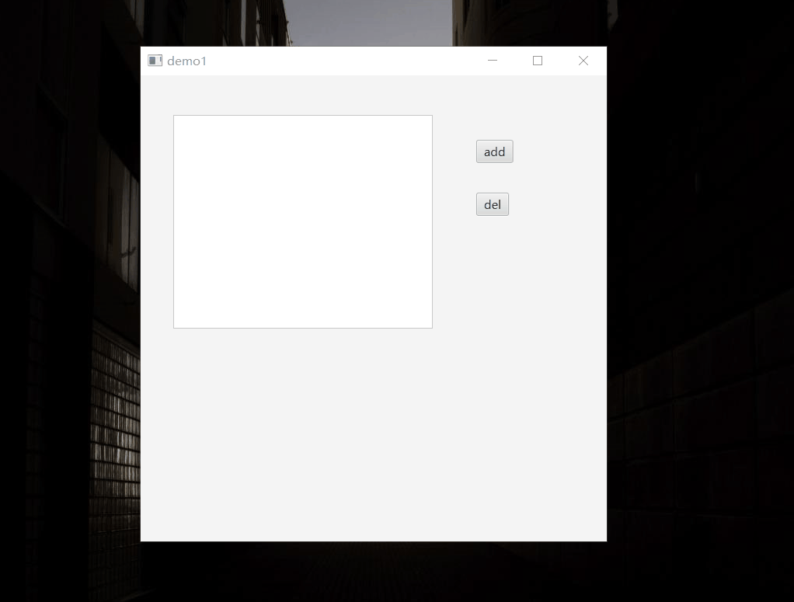

