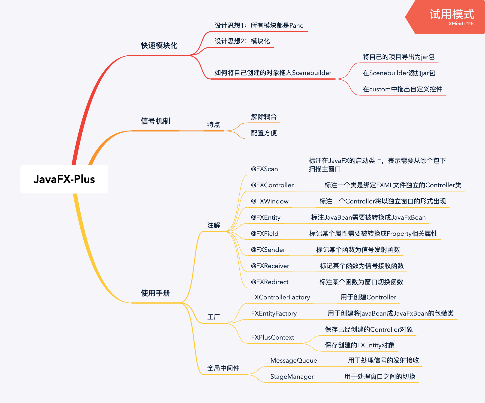

# JavaFX-Plus

- [JavaFX-Plus](#javafx-plus)
  * [前言](#前言)
    + [开发进程](#开发进程)
  * [Maven仓库地址](#Maven仓库地址)
  * [框架功能描述](#框架功能描述)
    + [模块化开发](#模块化开发)
      - [介绍](#介绍)
      - [如何创建模块](#如何创建模块)
      - [scenebuilder中导入刚刚生成的上面的控件](#scenebuilder中导入刚刚生成的上面的控件)
    + [与Spring的融合](#与Spring的融合)
    + [信号机制](#信号机制)
    + [JavaBean与JavaFXBean的转换](#JavaBean与JavaFXBean的转换)
    + [可拔插功能](#可拔插功能)
    + [数据绑定](#数据绑定)
      - [Bean和View绑定](#Bean和View绑定)
      - [View和View绑定](#View和View绑定)
      - [函数表达式绑定](#函数表达式绑定)
    + [多窗口切换功能](#多窗口切换功能)
  * [框架的使用](#框架的使用)
    + [内置注解](#内置注解)
    + [两个工厂和一个context](#两个工厂和一个context)
  * [创建第一个程序](#创建第一个程序)


## 前言

这个框架不是UI美化框架，为了简化javaFX项目开发、为了减少项目之间组件耦合而打造的框架。目前框架主要功能如下图所示：


### 开发进程
2019年11月25日起项目暂停更新，将会下次发布将会升级为2.0版本，到时候将会提供更多数据绑定操作，以及优化性能。

- [x]	模块化
- [x]	与Spring的融合
- [x]	信号机制
- [x]	JavaBean和JavaFXBean的转换
- [x]	可拔插功能(窗口拖动等功能)
- [x] 数据绑定
  - [x]   Bean和View的绑定
  - [x]   View和View的绑定
  - [x]   函数表达式绑定
- [x] 多窗口切换功能
- [ ]	事件注解绑定
- [ ]   数据校验
- [ ]   键盘事件绑定
- [ ]   优化性能

## Maven仓库地址
```xml

<dependency>
  <groupId>com.gitee.Biubiuyuyu</groupId>
  <artifactId>javafx-plus</artifactId>
  <version>1.0.0-RELEASE</version>
</dependency>

```

## 框架功能描述

### 模块化开发

#### 介绍

在Java开发过程中很多界面是相似或者重复的，如果能够将这些界面打包成为一个自定义控件，并且通过Scenebuilder拖动就能产生一个控件那将会大大提高我们的开发效率。所以我们提出将不同区域划分为不同的子模块，已达到减少耦合和加速并行开发。一般我们经常把界面分为顶部工具栏，左边导航栏，右侧的内容栏，如果全部内容都写在一个Controller那么将会导致十分臃肿，我们希望将不同的区域划分开来分而治之。

#### 如何创建模块

只要新建一个类继承自FXBaseController，而FXBaseController是继承于Pane，这就是JavaFX-Plus的设计思想之一切皆为Pane。在类上标上FXController注解，提供FXML文件的地址。如果设置为FXWindow那么将会把这个Controller以单独的Window显示，这里仅仅几句代码就实现了一个简单的窗口程序。


图2 Controller配置


图3 显示结果

#### scenebuilder中导入刚刚生成的上面的控件


图4 模块化操作


###  与Spring的融合

可以快速支持Spring和这个框架的融合，只需要一行代码，就可将实例的生成控制转交给容器管理。
代码如下:

```java
@FXScan(base = {"cn.edu.scau.biubiusuisui.example.springDemo"})
public class SpringDemo extends Application {
    @Override
    public void start(Stage primaryStage) throws Exception {
        ApplicationContext context = new ClassPathXmlApplicationContext("applicationContext.xml"); //启动spring
        FXPlusApplication.start(SpringDemo.class, new BeanBuilder() {
            @Override
            public Object getBean(Class type) {
                return  context.getBean(type); //接管FXPlus属性的创建
            }
        });
    }
}
```


###  信号机制

有两个主要标签一个是FXSender，这个标签作用在函数上，标记这个方法为信号发射函数。可以通过设置name修改这个信号发射函数的名称，默认是函数名字。

发射信号会被订阅了这个发射函数的所有FXReceiver接收，并且发射函数的返回值会作为参数传进这个函数之中。而且这种发送和接收关系是全局的，只要是注册了的Controller都可以进行接收，不局限于同一个Controller。

我们通过一个简单的代码来理解一下，主要实现自定义组件导航栏TopBar，主界面中包含该组件，当用户点击导航栏某些按钮时，能返回主界面相关信息。fxml文件详见resources下的mqDemo文件夹。

1. 利用JavaFX的模块化，我们设计一个简单的导航栏：

```java
@FXController(path = "mqDemo/topBar.fxml")
public class TopBarController extends FXBaseController {
    @FXML
    public void indexClick() {
        sendToMain("点击[首页]");
    }
    @FXML
    public void scoreClick() {
        sendToMain("点击[积分中心]");
    }
    @FXML
    public void questionClick() {
        sendToMain("点击[问答中心]");
    }
    @FXML
    public void selfClick() {
        sendToMain("点击[个人中心]");
    }

    /**
     * 系统会通过发射信号，调用所有订阅这个发射信号函数的方法,从而响应信号
     * @param msg
     * @return
     */
    @FXSender   //标注为信号发射函数
    public String sendToMain(String msg) {
        return msg;
    }
}
```


2. 再设计一个主界面，里面包含导航栏

```java
@FXController(path = "mqDemo/main.fxml")
@FXWindow(mainStage = true, title = "MQDemo")
public class MainController extends FXBaseController {

    @FXML
    private TextArea outTA;

    /**
     * 接收者必须指定要订阅的[发送者类名:方法名]
     * 发送函数的返回值会注入到接收函数的参数中
     *
     * @param msg
     */
    @FXReceiver(name = "TopBarController:sendToMain")
    public void handleTopBar(String msg) {
        // TODO: 2019/12/8
        // 处理导航栏的点击事件
        outTA.appendText(msg + "\n");
    }
}
```


### JavaBean与JavaFXBean的转换

 一般我们写的JavaBean都是基本类型的，但是JavaFXBean的设计哲学是这些属性都应该是JavaFX定义的Property类型，这十分不利于我们的开发，我们如何在不修改JavaBean的条件下，使用到JavaFX的Property的一些优良方法呢？答案是我们通过反射获得基本类型对应的Property（目前仅限于boolean，double，integer，long，string，float，List等基本类型，不支持封装对象。）


而本次设计的过程中希望尽量避免操作界面相关的Property等方法，而是直接操作JavaBean类。例如下面代码。

```java
@FXController(path = "Main.fxml")
@FXWindow(title = "demo1")
public class MainController extends FXBaseController{

    @FXML
    Button btn;

    @FXML
    Label label;

    Student student;

    int count = 1;

    @Override
    public void initialize() {
        student = (Student) FXEntityFactory.getInstance().createJavaBeanProxy(Student.class); //工厂产生一个学生
        student.setName("Jack"); //设置学生姓名
        FXEntityProxy fxEntityProxy = FXPlusContext.getProryByBeanObject(student); //获取学生代理
        Property nameProperty = fxEntityProxy.getPropertyByFieldName("name"); //获取Bean对应的Property
        //可以通过fxEntityProxy.getPropertyByFieldName("list"); 获得List的Property
        label.textProperty().bind(nameProperty); //属性绑定
    }

    @FXML
    @FXSender
    public String send(){
        student.setName("Jack :" + count); //操作会自动反应到界面上，无需再手动操作界面元素，专心业务部分。
        count++;
        return "sending msg";
    }

}
```


```java
@FXEntity
public class Student {

    @FXField
    private String name; //标记这个类要生成property对象

    private int age;

    private  String gender;

    private  String code;

    @FXField
    private List<String> list = new ArrayList<>(); //标记这个List要生成Property对象

    public String getName() {
        return name;
    }

    public void setName(String name) {
        this.name = name;
    }

    public int getAge() {
        return age;
    }

    public void setAge(int age) {
        this.age = age;
    }

    public String getGender() {
        return gender;
    }

    public void setGender(String gender) {
        this.gender = gender;
    }

    public String getCode() {
        return code;
    }

    public void setCode(String code) {
        this.code = code;
    }

    public void addList(String word){
        list.add(word);
    }
    public void delList(String word){
        list.remove(word);
    }
}


```

实现效果是:


直接操作JavaBean类，就会通过动态绑定修改界面，不需要讲JavaBean转换为JavaFX Bean可以减少开发中的类型转换。

###  可拔插功能

在本框架中实现了窗口可拖动和窗口可伸缩，在Javafx中如果一个窗口隐藏了标题栏那么这个窗口也就没办法拖动和伸缩了，在JavaFX-Plus中你就不需有这种烦恼，只需要在@FXWindow中设置

```java
@FXWindow(title = "demo1",dragable = true,style = StageStyle.UNDECORATED)
```
就可以让这个没有标题的窗口可以被拖动而且能拉伸（默认打开，可以关闭）


### 数据绑定 

与之相关的注解有`@FXBind`，注解在JavaFX控件的字段上面，标明该变量的绑定方式和绑定属性，类似于Vue中的界面绑定。目前已实现Bean和View的绑定、View和View的绑定、函数表达式的绑定

#### Bean和View绑定
如下面代码，通过FXBind将Student的姓名与文本框输入内容绑定，学生的密码和密码框输入框内容绑定，完全简化了数据传递操作，代码中完全没有出现界面数据传输到控制器代码。
例子:

```java
    @FXData
    @FXBind(
            {
                    "name=${usr.text}",
                    "password=${psw.text}"
            }
    )
    Student student = new Student();

    @FXML
    private PasswordField psw;

    @FXML
    private Label pswMsg;

    @FXML
    void login(ActionEvent event) {
        System.out.println("user:" + student.getName());
        System.out.println("psw:" + student.getPassword());
        if ("admin".equals(student.getName()) && "admin".equals(student.getPassword())) {
            System.out.println("Ok");
        } else {
            System.out.println("fail");
        }
    }
    

```
如图所示:


#### View和View绑定

```java
@FXBind("text=${psw.text}")
@FXML
private Label pswMsg;//任何psw中的内容都会同步到pswMsg中
```
如图所示


#### 函数表达式绑定

示例代码可见`cn.edu.scau.biubiusuisui.example.listDemo`和 `cn.edu.scau.biubiusuisui.actionDemo`，以下举actionDemo为例。

1. 使用方法

使用在界面Controller类中的JavaFX控件上，与以上两种绑定类似，以`${}`为外部标识，当该绑定属于函数表达式绑定时，需要在函数名前加`@`。

```java
@FXBind("text=${@toUs(time.text)}") // 将Label中的text和toUs()函数的返回值绑定
private Label us;
```

2. 示例代码

如以下代码，实现简单的汇率转换器。

```java
@FXController(path = "actionDemo/actionDemo.fxml")
@FXWindow(title = "actionDemo", mainStage = true)
public class MainController extends FXBaseController implements Initializable {
    @FXML
    @FXBind("text=${@toUs(time.text)}") // 将Label中的text和toUs()函数的返回值绑定
    private Label us;

    @FXML
    @FXBind("text=${@toJp(time.text)}")
    private Label jp;

    @FXML
    @FXBind("text=${@toUk(time.text)}")
    private Label uk;

    @FXML
    private TextField time;

    public String toUs(String value) {
        double money = Double.valueOf(value);
        double percent = 0.1454;
        return String.valueOf(money * percent);
    }

    public String toJp(String value) {
        double money = Double.valueOf(value);
        double percent = 15.797;
        return String.valueOf(money * percent);
    }

    public String toUk(String value) {
        double money = Double.valueOf(value);
        double percent = 0.1174;
        return String.valueOf(money * percent);
    }
}
```

3. 动态演示

如图所示：


### 多窗口切换功能

#### 介绍

在JavaFX中常常需要多个窗口之间进行切换，比如登录窗口，点击登录后跳转至登录成功/失败窗口，网上部分有关多窗口切换的JavaFX教程实现过程为：在Controller中是实现FXML绑定，并通过外部调用某个show方法来切换窗口。由于本框架已经将FXML绑定这一功能封装，故通过在Controller内部直接初始化Stage并设置参数这一方法并不现实。因此，在本框架中，编写StageController类对Controller进行管理。

#### 涉及到的注解

`@FXController`：标记于类上，用于绑定FXML文件，需要注意的是标记了`FXController`只能标记这是一个控件。

`@FXWindow`：标记于类上，标记这个Controller需要以窗口显示，只有需要以单独窗口显示时才会被重定向。

`@FXRedirect`：标记于函数上，标记该函数用于处理重定向。

#### 规定

本框架规定，当需要使用`@FXRedirect`标记函数处理重定向时，函数必须是返回String类型的函数，且返回已注册的Controller名，如需要重定向至登录成功界面，控制器为`SuccessController`，则需要写上`return "SuccessController"。

#### 使用方法

1. `FXRedirect`注解的使用如下：

   ```java
       @FXRedirect
       public String redirectToRegister() {
           return "RegisterController";
       }
   
       @FXML
       @FXRedirect(close = false) //测试弹窗
       public String redirectToDialog() {
           return "DialogController";
       }
   ```

   ​	close是标明是否需要关闭当前的窗口，默认为true，即默认当跳转另一个窗口时关闭当前窗口。

2. 创建程序初始界面Controller，此处举例为登录界面

   ```java
   @FXController(path = "redirectDemo/login.fxml")
   @FXWindow(title = "redirectDemo", mainStage = true)
   public class LoginController extends FXBaseController {
   
       @FXML
       private TextField usernameTF;
   
       @FXML
       private PasswordField passwordPF;
   
       @FXML
       public void registerClick() {
           System.out.println("点击注册.....");
           redirectToRegister();
       }
   
       @FXRedirect
       public String redirectToRegister() {
           return "RegisterController";
       }
   
       @FXML
       @FXRedirect(close = false) //测试弹窗
       public String redirectToDialog() {
           return "DialogController";
       }
   }
   
   ```

3. 编写需要跳转的界面Controller，比如登录时，尚无账号跳转至注册界面和测试弹窗的Controller

   ```java
   @FXController(path = "redirectDemo/register.fxml")
   @FXWindow(title = "register")
   public class RegisterController extends FXBaseController {
       @FXML
       private TextField usernameTF;
       @FXML
       private TextField emailTF;
       @FXML
       private PasswordField passwordPF;
   
       @FXML
       private PasswordField confirmPasswordPF;
   
       @FXML
       public void registerClick() {
   
       }
   
       @FXML
       public void loginClick() {
           redirectToLogin();
       }
   
       @FXRedirect
       public String redirectToLogin() {
           return "LoginController";
       }
   }
   ```

   ```java
   @FXController(path = "redirectDemo/dialog.fxml")
   @FXWindow(title = "弹窗")
   public class DialogController extends FXBaseController {
   }
   ```

   

#### 示例演示

本次示例源码已存于`cn.edu.scau.biubiusuisui.example.redirectDemo`，fxml文件于resources下的redirectDemo文件夹中。

1. 跳转至另一个窗口（关闭原窗口）


2. 弹窗形式弹出窗口（不关闭原窗口）


#### 不足之处

暂未实现携带数据的窗口跳转，目前只实现纯粹跳转到另一个Controller。


##  框架的使用
###  内置注解

| 名字          | 作用                                                         | 参数                                    | 要求                                     |
| ------------- | ------------------------------------------------------------ | --------------------------------------- | ---------------------------------------- |
| @FXData       | 标明这个普通bean要装配成javafxBean                           | fx_id                                   | 重新命名                                 |
| @FXScan       | 扫描@FXEntity和@FXController注解标记的类                     | 要扫描的目录                            | 默认当前目录之下所有                     |
| @FXController | 标记这个类为控件                                             | path：fxml文件地址                      | 无                                       |
| @FXWindow     | 标记这个控件要以单独窗口显示                                 | title是窗口名字，也可以设置窗口长度宽度 | 无                                       |
| @FXEntity     | 标记JavaBean系统会自动识别@FXField然后包装JavaBean为JavaFXBean | 重命名                                  |                                          |
| @FXField      | 代表这个属性要映射为Property属性                             |                                         |                                          |
| @FXSender     | 信号发送者                                                   | name：重命名信号                        |                                          |
| @FXReceiver   | 信号接收函数                                                 | name：订阅的发射者函数名                | 不可空                                   |
| @FXRedirect   | 标记函数为重定向函数                                         | close：是否关闭当前窗口                 | 返回值为某个使用了FXView注解的Controller |

### 两个工厂和一个context

1. 两个工厂

在JavaFX-Plus中所有Controller对象和FXEnity对象都必须通过工厂创建。

```java
student = (Student) FXEntityFactory.getInstance().createJavaBeanProxy(Student.class); //工厂产生一个学生 
```

通过工厂创建JavaBean，在创建的同时，工厂会对JavaBean代理并且包装对应的Property属性。

```java
MainController mainController = (MainController)FXFactory.getFXController(MainController.class); 
```

2. 一个context

存储所有用@FXController注解后的Controller和FXEntity的代理类。

```java
public class FXPlusContext {

    private FXPlusContext(){}

    private static Map<String, List<FXBaseController>> controllerContext = new ConcurrentHashMap<>(); //FXController控制器注册表

    private static Map<Object, FXEntityProxy> beanMap = new ConcurrentHashMap<>(); // Object注册为FXEntityObject


    public static void addController(FXBaseController fxBaseController){
        List<FXBaseController> controllers = controllerContext.get(fxBaseController.getName());
        if(controllers == null){
            controllers = new LinkedList<>();
        }
        controllers.add(fxBaseController);
    }

    public static List<FXBaseController> getControllers(String key){
        return controllerContext.get(key);
    }

    public static FXEntityProxy getProxyByBeanObject(Object object){
        return beanMap.get(object);
    }

    public static void setProxyByBeanObject(Object object,FXEntityProxy fxEntityProxy){
         beanMap.put(object,fxEntityProxy);
    }
}
```


##  创建第一个程序

1. 主程序类。

```java
@FXScan(base = {"cn.edu.scau.biubiusuisui.example"}) //会扫描带FXController和FXEntity的类进行初始化
public class Demo extends Application {
    @Override
    public void start(Stage primaryStage) throws Exception {
        FXPlusApplication.start(Demo.class);  //其他配置和JavaFX相同，这里要调用FXPlusAppcalition的start方法，开始FX-plus加强
    }
}

```
2. 接下来我们生成FXML和Controller

```java
@FXController(path = "Main.fxml")
@FXWindow(title = "demo1")
public class MainController extends FXBaseController{
    @FXML
    private ResourceBundle resources;
    @FXML
    private URL location;
    @FXML
    private Button addBtn;
    @FXML
    private Button delBtn;
    @FXML
    private ListView<String> list;

    Student student;

    @FXML
    void addWord(ActionEvent event) {
        student.addList("hello" );
    }

    @FXML
    void delWord(ActionEvent event) {
        student.delList("hello");
    }

    @Override
    public void initialize() {
        student = (Student) FXEntityFactory.createJavaBeanProxy(Student.class);  // 从工厂中拿到将JavaBean转换得到的JavaFXBean
        Property listProperty = FXPlusContext.getEntityPropertyByName(student, "list");
        list.itemsProperty().bind(listProperty);
    }
}

```
Studen类的定义如下    

```java

@FXEntity
public class Student {

    @FXField	//标记该属性是否被生成对应的Property
    private String name;

    @FXField
    private List<String> list = new ArrayList<>();

    public void addList(String word){
        list.add(word);
    }
    public void delList(String word){
        list.remove(word);
    }
}
```

请注意，FXML文件的根标签必须为`<fx:root>`。

```xml
<?xml version="1.0" encoding="UTF-8"?>

<?import javafx.scene.control.Button?>
<?import javafx.scene.control.ListView?>
<?import javafx.scene.layout.Pane?>

<fx:root prefHeight="400.0" prefWidth="600.0" type="Pane" xmlns="http://javafx.com/javafx/8.0.171" xmlns:fx="http://javafx.com/fxml/1" fx:controller="cn.edu.scau.biubiusuisui.example.MainController">
   <children>
      <Button fx:id="addBtn" layoutX="432.0" layoutY="83.0" mnemonicParsing="false" onAction="#addWord" text="add" />
      <Button fx:id="delBtn" layoutX="432.0" layoutY="151.0" mnemonicParsing="false" onAction="#delWord" text="del" />
      <ListView fx:id="list" layoutX="42.0" layoutY="51.0" prefHeight="275.0" prefWidth="334.0" />
   </children>
</fx:root>

```

从我们代码可以看出，我们很少有操作界面的操作，并且我们操作的对象都是基本类型的对象，这样的操作十分有利于我们将普通的项目转换为JavaFX项目，最终运行起来将会是这样


