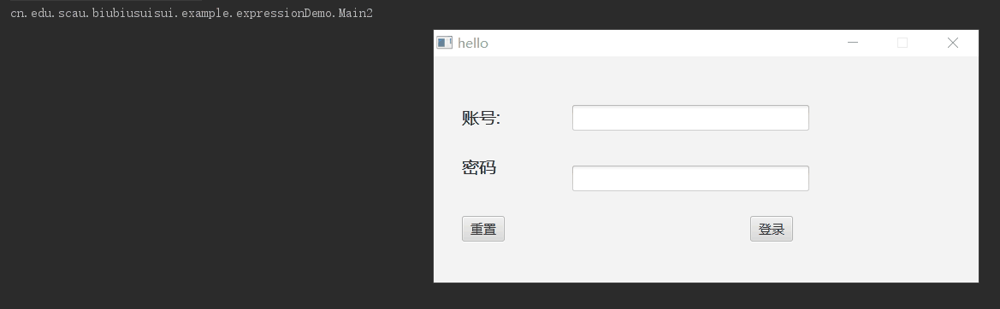

# JavaFX-Plus

其他语言 ： [English](README.en.md)

## 目录

[前言](#前言)

- [开发进程](#开发进程)

[Maven仓库地址](#Maven仓库地址)

[Git地址](#git地址)

[具体应用](#具体应用)

[框架功能描述](#框架功能描述)

- [模块化开发](#模块化开发)
  - [介绍](#描述)
  - [如何创建模块](#如何创建模块)
  - [scenebuilder中导入刚刚生成的上面的控件](#scenebuilder中导入刚刚生成的上面的控件)
- [与Spring的融合](#与Spring的融合)
- [日志](#日志)
  - [介绍](#介绍)
  - [如何使用](#如何使用)
  - [输出结果](#输出结果)
- [生命周期](#生命周期)
  - [说明](#说明)
  - [多个Controller的生命周期](#多个Controller的生命周期)
  - [示例](#示例)
- [信号机制](#信号机制)
- [JavaBean与JavaFXBean的转换](#JavaBean与JavaFXBean的转换)
- [可拔插功能](#可拔插功能)
- [数据绑定](#数据绑定)
  - [Bean和View绑定](#Bean和View绑定)
  - [View和View绑定](#View和View绑定)
  - [函数表达式绑定](#函数表达式绑定)
- [多窗口切换功能](#多窗口切换功能)
- [介绍](#功能介绍)
  - [涉及到的注解](#涉及到的注解)
- [规定](#规定)
  - [使用方法](#使用方法)
  - [示例演示](#示例演示)
- [国际化和本地化](#国际化和本地化)
  - [介绍](#模块介绍)
  - [使用方法](#使用方法)
  - [示例演示](#示例演示)

[框架的使用](#框架的使用)

- [代码模板](#代码模板)
  - [JavaFXPlusApplication](#JavaFXPlusApplication)
  - [JavaFXPlusWindow](#JavaFXPlusWindow)
  - [JavaFXPlusController](#JavaFXPlusController)
  - [JavaFXPlusFXML](#JavaFXPlusFXML)

- [内置注解](#内置注解)

- [两个工厂和一个context](#两个工厂和一个context)

[创建第一个程序](#创建第一个程序)

[更新列表](#更新列表)

## 前言

这个框架不是UI美化框架，为了简化javaFX项目开发、为了减少项目之间组件耦合而打造的框架。目前框架主要功能如下图所示：


### 开发进程
2019年11月25日起项目暂停更新，将会下次发布将会升级为2.0版本，到时候将会提供更多数据绑定操作，以及优化性能。

- [x]	模块化
- [x]	与Spring的融合
- [x]	信号机制
- [x]	JavaBean和JavaFXBean的转换
- [x]	可拔插功能(窗口拖动等功能)
- [x] 数据绑定
  - [x]   Bean和View的绑定
  - [x]   View和View的绑定
  - [x]   函数表达式绑定
- [x] 多窗口切换功能
- [ ]	事件注解绑定
- [ ]   数据校验
- [ ]   键盘事件绑定
- [ ]   优化性能

## Maven仓库地址
```xml
<dependency>
  <groupId>com.gitee.Biubiuyuyu</groupId>
  <artifactId>javafx-plus</artifactId>
  <version>1.0.0-RELEASE</version>
</dependency>
```
## Git地址

```
Github		https://github.com/BillKiller/JavaFX-Plus.git
Gitee		https://gitee.com/Biubiuyuyu/JavaFX-Plus.git
```


## 具体应用

可见 [下载器](https://gitee.com/Biubiuyuyu/JavaFX-Demo 'Demo')

## 框架功能描述

### 模块化开发

#### 描述

在Java开发过程中很多界面是相似或者重复的，如果能够将这些界面打包成为一个自定义控件，并且通过Scenebuilder拖动就能产生一个控件那将会大大提高我们的开发效率。所以我们提出将不同区域划分为不同的子模块，已达到减少耦合和加速并行开发。一般我们经常把界面分为顶部工具栏，左边导航栏，右侧的内容栏，如果全部内容都写在一个Controller那么将会导致十分臃肿，我们希望将不同的区域划分开来分而治之。

#### 如何创建模块

只要新建一个类继承自FXBaseController，而FXBaseController是继承于Pane，这就是JavaFX-Plus的设计思想之一切皆为Pane。在类上标上FXController注解，提供FXML文件的地址。如果设置为FXWindow那么将会把这个Controller以单独的Window显示，这里仅仅几句代码就实现了一个简单的窗口程序。


图2 Controller配置


图3 显示结果

#### scenebuilder中导入刚刚生成的上面的控件


图4 模块化操作


###  与Spring的融合

可以快速支持Spring和这个框架的融合，只需要一行代码，就可将实例的生成控制转交给容器管理。
代码如下:

```java
@FXScan(base = {"cn.edu.scau.biubiusuisui.example.springDemo"})
public class SpringDemo extends Application {
    @Override
    public void start(Stage primaryStage) throws Exception {
        ApplicationContext context = new ClassPathXmlApplicationContext("applicationContext.xml"); //启动spring
        FXPlusApplication.start(SpringDemo.class, new BeanBuilder() {
            @Override
            public Object getBean(Class type) {
                return  context.getBean(type); //接管FXPlus属性的创建
            }
        });
    }
}
```


### 日志

#### 介绍

JavaFX-Plus集成log4j框架，进行日志处理，可以控制日志信息的输送，并可通过配置文件log4j.properties进行灵活配置，便于开发者能快速定位关键开发过程中的异常错误。

对于Maven项目而言，log4j其配置文件log4j.properties或log4j.xml默认放在resources文件夹下（如下图），若文件路径不符合，则需要在代码中另行设置，否则log4j将无法正常启动，提示file not existed。


#### 如何使用

1. log4j.properties的处理

   - log4j.properties的示例代码如下，JavaFX-Plus默认DEBUG和ERROR级别以上的日志会输出至当前目录的`logs/debug/javafxplus.log`和`logs/debug/javafxplus.log`。

     ```properties
     ### 设置###
     log4j.rootLogger=debug,stdout,D,E
     ### 输出信息到控制台 ###
     log4j.appender.stdout=org.apache.log4j.ConsoleAppender
     log4j.appender.stdout.Target=System.out
     log4j.appender.stdout.layout=org.apache.log4j.PatternLayout
     log4j.appender.stdout.layout.ConversionPattern=[%-5p] %d{yyyy-MM-dd HH:mm:ss,SSS} [%t] [%c] - %m%n
     ### 输出DEBUG 级别以上的日志到=E://logs/error.log ###
     log4j.appender.D=org.apache.log4j.DailyRollingFileAppender
     ### Windowsy
     #log4j.appender.D.File = E://logs/debug/log.log
     # MacOS
     log4j.appender.D.File=${log.base}/logs/debug/javafxplus.log
     log4j.appender.D.Append=true
     log4j.appender.D.Threshold=DEBUG 
     log4j.appender.D.layout=org.apache.log4j.PatternLayout
     log4j.appender.D.layout.ConversionPattern=[%p] %-d{yyyy-MM-dd HH:mm:ss}  [%t] [%l] - %m%n
     ### 输出ERROR 级别以上的日志到=E://logs/error.log ###
     log4j.appender.E=org.apache.log4j.DailyRollingFileAppender
     ### Windows
     #log4j.appender.E.File = E://logs/error/log.log
     # MacOS
     log4j.appender.E.File=${log.base}/logs/error/javafxplus.log
     log4j.appender.E.Append=true
     log4j.appender.E.Threshold=ERROR 
     log4j.appender.E.layout=org.apache.log4j.PatternLayout
     log4j.appender.E.layout.ConversionPattern=[%p] %-d{yyyy-MM-dd HH:mm:ss}  [%t] [%l] - %m%n
     ```

   - 动态配置日志的输出路径

     在log.properties中`${log.base}`表示系统变量，可自定义。默认情况下，JavaFX-Plus取当前项目路径为log.base的值。但是也可以通过JavaFX-Plus的LogUtil类提供的方法`initLog4jBase(String base)`，其中base为log.base的值。

   

2. 打印日志的两种方式

   - 通过FXPlusLoggerFactory的getLogger()方法，传入当前类的Class，获取IFXPlusLogger，即可通过其提供`info`, `debug`, `error`等方法打印日志，如以下的`testLogger()`。

   - 通过LogUtil的静态方法`info`, `debug`, `error`等打印日志，如以下的`testLogUtil()`。

     ```java
     public class LogDemo {
         private static IFXPlusLogger logger = FXPlusLoggerFactory.getLogger(LogDemo.class);
         
         public void testLogger() {
             logger.info("info");
             logger.error("error");
             logger.debug("debug");
             logger.warn("warn");
         }
         public void testLogUtil() {
             LogUtil.info("info");
             LogUtil.error("error");
             LogUtil.debug("debug");
             LogUtil.warn("warn");
         }
         public static void main(String[] args) {
             LogDemo demo = new LogDemo();
             demo.testLogger();
             demo.testLogUtil();
         }
     }
     ```

#### 输出结果

两种打印日志的方式是有区别的，两种日志所停留的类名是不同的，但是均可准确定位到所打日志的某一行。

```
[INFO ] 2020-05-03 01:22:40,165 [main] [cn.edu.scau.biubiusuisui.example.logDemo.LogDemo.testLogger(LogDemo.java:18)] - info
[ERROR] 2020-05-03 01:22:40,169 [main] [cn.edu.scau.biubiusuisui.example.logDemo.LogDemo.testLogger(LogDemo.java:19)] - error
[DEBUG] 2020-05-03 01:22:40,169 [main] [cn.edu.scau.biubiusuisui.example.logDemo.LogDemo.testLogger(LogDemo.java:20)] - debug
[WARN ] 2020-05-03 01:22:40,169 [main] [cn.edu.scau.biubiusuisui.example.logDemo.LogDemo.testLogger(LogDemo.java:21)] - warn
[INFO ] 2020-05-03 01:22:40,170 [main] [cn.edu.scau.biubiusuisui.example.logDemo.LogDemo.testLogUtil(LogDemo.java:25)] - info
[ERROR] 2020-05-03 01:22:40,170 [main] [cn.edu.scau.biubiusuisui.example.logDemo.LogDemo.testLogUtil(LogDemo.java:26)] - error
[DEBUG] 2020-05-03 01:22:40,173 [main] [cn.edu.scau.biubiusuisui.example.logDemo.LogDemo.testLogUtil(LogDemo.java:27)] - debug
[WARN ] 2020-05-03 01:22:40,173 [main] [cn.edu.scau.biubiusuisui.example.logDemo.LogDemo.testLogUtil(LogDemo.java:28)] - warn
```


### 生命周期

JavaFX应用程序是具有生命周期的，JavaFX-Plus则参考微信小程序和Vue的生命周期，在原生JavaFX生命周期基础上，将从JavaFXApplication启动到JavaFXController进行初始化注册的一系列动作抽象出来，为开发者提供几个函数的空实现，如：若开发过程中需要在页面之前进行相关操作，如数据加载等，可重写`onShow`函数，在函数体中进行相关操作。测试生命周期可见示例：`cn.edu.scau.biubiusuisui.example.lifeDemo`

#### 说明

以下说明JavaFX-Plus的生命周期：

**`launch()`**: 启动独立JavaFX Application，为JavaFX原生static函数，不可重写。

**`init()`**:  JavaFXApplication完成初始化操作的方法，在加载和构造应用程序类（`launch()`）后立即调用。应用程序可重写此方法，以便在实际启动应用程序之前进行初始化。此方法为JavaFX-Launcher线程，非UI线程，不可在此进行UI操作。

**`start()`**: 所有JavaFX Application的主入口。当init方法执行完成后，将调用start方法，该方法为JavaFX Application线程，可在此进行UI操作。

**`stop()`**: 当JavaFX应用程序停止时，会优先执行该函数，以便于应用程序结束时进行相关资源销毁等操作，该方法为JavaFX Application线程，可在此进行UI操作。

**`constructor()`**: constructor并不是实际函数，此处指代JavaFXController的构造函数。

**`onLoad()`**: 监听FXML页面的加载，在页面加载前进行调用，应用程序可重写此方法，以便在加载FXML页面之前进行相关操作，全局只触发一次。

**`initialize()`**: 初始化函数，在页面加载后方调用，应用程序可重写此方法，一般用于在显示页面之前初始化某些控件初始值，全局只触发一次。

**`onShow()`**: 监听页面的显示，在页面显示前进行调用，应用程序可重写此方法，以便于在显示页面前进行相关数据处理等操作。

**`onHide()`**: 监听页面隐藏或从前台到后台的操作，应用程序可重写此方法。

**`onClose()`**: 监听页面的关闭，如窗口标题栏的关闭按钮、`stage.close()`等方式关闭前进行调用，应用程序可重写此方法。


补充说明：

1. 我们所认识的隐藏页面即最小化窗口，而在JavaFX官方文档中`stage.hide()`和`stage.close()`是等价的，故开发者在使用原生的这两个函数时需要注意。JavaFX文档：http://docs.oracle.com/javafx/2/api/javafx/stage/Stage.html#close()
2. 默认情况下，JavaFX应用程序运行时会在最后一个Stage被Close后默认自动退出，即自动调用`Application.stop()`，如果需要取消这项默认操作，可设置`Platform.setImplicitExit(false);`，可用于一些关闭了桌面页面仍可以后台运行的程序，比如后台下载等。


#### 多个Controller的生命周期

当JavaFX-Plus程序中含有多个Controller时，首先按照注解FXScan中base的属性值的包下按照字典顺序进行扫描注册，当某个Controller（父组件）中引用了另一个Controller（子组件）时，父组件加载完FXML页面后会进入子组件的初始化过程，子组件完成`initialize()`后，方返回执行父组件的`initialize()`。


#### 示例

1. 通过运行`cn.edu.scau.biubiusuisui.example.lifeDemo`，会在Console打印出相关信息。

   

   

2. 其组件构图如下，父组件中含有子组件，父组件还可通过按钮弹出某个已设置好的窗口。

   

   

   3. 首先，在默认情况下，在FXPlusApplication（此例子中为LifeDemo）中的`@FXScan`注解的base属性标注的包下，按照字典顺序进行扫描注册。注册完DialogController后，注册MainController时，由于其中FXML文件引用了SubController，故在MainController执行完加载FXML操作后，会跳转至SubController的注册过程，然后才回到MainController的`initialize`。

   

   

   然后，当点击弹窗按钮时，DialogController的`showStage()`被调用，此时触发`onShow`操作，点击关闭按钮，触发`onClose`操作，最小化最大化时分别触发`onHide`和`onShow`操作。

   


###  信号机制

有两个主要标签一个是FXSender，这个标签作用在函数上，标记这个方法为信号发射函数。可以通过设置name修改这个信号发射函数的名称，默认是函数名字。

发射信号会被订阅了这个发射函数的所有FXReceiver接收，并且发射函数的返回值会作为参数传进这个函数之中。而且这种发送和接收关系是全局的，只要是注册了的Controller都可以进行接收，不局限于同一个Controller。

我们通过一个简单的代码来理解一下，主要实现自定义组件导航栏TopBar，主界面中包含该组件，当用户点击导航栏某些按钮时，能返回主界面相关信息。fxml文件详见resources下的mqDemo文件夹。

1. 利用JavaFX的模块化，我们设计一个简单的导航栏：

```java
@FXController(path = "fxml/mqDemo/topBar.fxml")
public class TopBarController extends FXBaseController {
    @FXML
    public void indexClick() {
        sendToMain("点击[首页]");
    }
    @FXML
    public void scoreClick() {
        sendToMain("点击[积分中心]");
    }
    @FXML
    public void questionClick() {
        sendToMain("点击[问答中心]");
    }
    @FXML
    public void selfClick() {
        sendToMain("点击[个人中心]");
    }

    /**
     * 系统会通过发射信号，调用所有订阅这个发射信号函数的方法,从而响应信号
     * @param msg
     * @return
     */
    @FXSender   //标注为信号发射函数
    public String sendToMain(String msg) {
        return msg;
    }
}
```


2. 再设计一个主界面，里面包含导航栏

```java
@FXController(path = "fxml/mqDemo/main.fxml")
@FXWindow(mainStage = true, title = "MQDemo")
public class MainController extends FXBaseController {

    @FXML
    private TextArea outTA;

    /**
     * 接收者必须指定要订阅的[发送者类名:方法名]
     * 发送函数的返回值会注入到接收函数的参数中
     *
     * @param msg
     */
    @FXReceiver(name = "TopBarController:sendToMain")
    public void handleTopBar(String msg) {
        // 处理导航栏的点击事件
        outTA.appendText(msg + "\n");
    }
}
```


### JavaBean与JavaFXBean的转换

 一般我们写的JavaBean都是基本类型的，但是JavaFXBean的设计哲学是这些属性都应该是JavaFX定义的Property类型，这十分不利于我们的开发，我们如何在不修改JavaBean的条件下，使用到JavaFX的Property的一些优良方法呢？答案是我们通过反射获得基本类型对应的Property（目前仅限于boolean，double，integer，long，string，float，List等基本类型，不支持封装对象。）


而本次设计的过程中希望尽量避免操作界面相关的Property等方法，而是直接操作JavaBean类。例如下面代码。

```java
@FXController(path = "fxml/Main.fxml")
@FXWindow(title = "demo1")
public class MainController extends FXBaseController{

    @FXML
    Button btn;

    @FXML
    Label label;
    
    Student student;

    int count = 1;

    @Override
    public void initialize() {
        student = (Student) FXEntityFactory.wrapFxBean(Student.class); //工厂产生一个学生
        student.setName("Jack"); //设置学生姓名
        Property nameProperty = FXPlusContext.getEntityPropertyByName(student, "name");
        label.textProperty().bind(nameProperty); //属性绑定
    }

    @FXML
    @FXSender
    public String send(){
        student.setName("Jack :" + count); //操作会自动反应到界面上，无需再手动操作界面元素，专心业务部分。
        count++;
        return "sending msg";
    }

}
```


```java
@FXEntity
public class Student {

    @FXField
    private String name; //标记这个类要生成property对象

    private int age;

    private  String gender;

    private  String code;

    @FXField
    private List<String> list = new ArrayList<>(); //标记这个List要生成Property对象

    public String getName() {
        return name;
    }

    public void setName(String name) {
        this.name = name;
    }

    public int getAge() {
        return age;
    }

    public void setAge(int age) {
        this.age = age;
    }

    public String getGender() {
        return gender;
    }

    public void setGender(String gender) {
        this.gender = gender;
    }

    public String getCode() {
        return code;
    }

    public void setCode(String code) {
        this.code = code;
    }

    public void addList(String word){
        list.add(word);
    }
    public void delList(String word){
        list.remove(word);
    }
}


```

实现效果是:


直接操作JavaBean类，就会通过动态绑定修改界面，不需要讲JavaBean转换为JavaFX Bean可以减少开发中的类型转换。

###  可拔插功能

在本框架中实现了窗口可拖动和窗口可伸缩，在Javafx中如果一个窗口隐藏了标题栏那么这个窗口也就没办法拖动和伸缩了，在JavaFX-Plus中你就不需有这种烦恼，只需要在@FXWindow中设置。

```java
@FXWindow(title = "demo1",dragable = true,style = StageStyle.UNDECORATED) // 可拖动
```
就可以让这个没有标题的窗口可以被拖动而且能拉伸（默认打开，可以关闭）


```java
@FXWindow(title = "demo1",resizable = true,style = StageStyle.UNDECORATED) // 可缩放
```


### 数据绑定 

与之相关的注解有`@FXBind`，注解在JavaFX控件的字段上面，标明该变量的绑定方式和绑定属性，类似于Vue中的界面绑定。目前已实现Bean和View的绑定、View和View的绑定、函数表达式的绑定

#### Bean和View绑定
如下面代码，通过FXBind将Student的姓名与文本框输入内容绑定，学生的密码和密码框输入框内容绑定，完全简化了数据传递操作，代码中完全没有出现界面数据传输到控制器代码。
例子:

```java
    @FXData
    @FXBind(
            {
                    "name=${usr.text}",
                    "password=${psw.text}"
            }
    )
    Student student = new Student();
	
	@FXML
	private TestField usr; 
    @FXML
    private PasswordField psw;

    @FXML
    private Label pswMsg;

    @FXML
    void login(ActionEvent event) {
        System.out.println("user:" + student.getName());
        System.out.println("psw:" + student.getPassword());
        if ("admin".equals(student.getName()) && "admin".equals(student.getPassword())) {
            System.out.println("Ok");
        } else {
            System.out.println("fail");
        }
    }
    

```
如图所示:


#### View和View绑定

```java
@FXBind("text=${psw.text}")
@FXML
private Label pswMsg;//任何psw中的内容都会同步到pswMsg中

@FXML
private PasswordField psw;
```
如图所示



#### 函数表达式绑定

示例代码可见`cn.edu.scau.biubiusuisui.example.listDemo`和 `cn.edu.scau.biubiusuisui.actionDemo`，以下举actionDemo为例。

1. 使用方法

使用在界面Controller类中的JavaFX控件上，与以上两种绑定类似，以`${}`为外部标识，当该绑定属于函数表达式绑定时，需要在函数名前加`@`。

```java
@FXBind("text=${@toUs(time.text)}") // 将Label中的text和toUs()函数的返回值绑定
private Label us;
```

2. 示例代码

如以下代码，实现简单的汇率转换器。

```java
@FXController(path = "fxml/bindDemo/bindDemo.fxml")
@FXWindow(title = "fxml/bindDemo", mainStage = true)
public class MainController extends FXBaseController implements Initializable {
    @FXML
    @FXBind("text=${@toUs(time.text)}") // 将Label中的text和toUs()函数的返回值绑定
    private Label us;

    @FXML
    @FXBind("text=${@toJp(time.text)}")
    private Label jp;

    @FXML
    @FXBind("text=${@toUk(time.text)}")
    private Label uk;

    @FXML
    private TextField time;

    public String toUs(String value) {
        double money = Double.valueOf(value);
        double percent = 0.1454;
        return String.valueOf(money * percent);
    }

    public String toJp(String value) {
        double money = Double.valueOf(value);
        double percent = 15.797;
        return String.valueOf(money * percent);
    }

    public String toUk(String value) {
        double money = Double.valueOf(value);
        double percent = 0.1174;
        return String.valueOf(money * percent);
    }
}
```

3. 动态演示

如图所示：


### 多窗口切换功能

#### 功能介绍

在JavaFX中常常需要多个窗口之间进行切换，比如登录窗口，点击登录后跳转至登录成功/失败窗口，网上部分有关多窗口切换的JavaFX教程实现过程为：在Controller中是实现FXML绑定，并通过外部调用某个show方法来切换窗口。由于本框架已经将FXML绑定这一功能封装，故通过在Controller内部直接初始化Stage并设置参数这一方法并不现实。因此，在本框架中，编写StageController类对Controller进行管理。

#### 涉及到的注解

`@FXController`：标记于类上，用于绑定FXML文件，需要注意的是标记了`FXController`只能标记这是一个控件。

`@FXWindow`：标记于类上，标记这个Controller需要以窗口显示，只有需要以单独窗口显示时才会被重定向。

`@FXRedirect`：标记于函数上，标记该函数用于处理重定向。

#### 规定

本框架规定，当需要使用`@FXRedirect`标记函数处理重定向时，函数必须是返回`String`或`FXRedirectParam`类型的函数，均需要提供已注册的Controller名，例如需要重定向至登录成功界面，控制器为`SuccessController`，则需要写上`return "SuccessController"`，此时并未携带相关数据，如需携带数据可使用返回URL的方式或返回`FXRedirectParam`，参考以下用法。

#### 使用方法

1. `FXRedirect`注解的使用如下：

   ```java
   @FXRedirect
   public String redirectToRegister() {
   	return "RegisterController";
   }
   
   @FXML
   @FXRedirect(close = false) //测试弹窗
   public String redirectToDialog() {
   	return "DialogController";
   }
   
   @FXML
   @FXRedirect //登录成功 Query方式
   public String redirectToSuccessWithQuery() {
   	return "SuccessController?username=" + usernameTF.getText();
   }
   
   @FXML
   @FXRedirect //登录成功 Param方式
   public FXRedirectParam redirectToSuccessWithParam() {
       FXRedirectParam params = new FXRedirectParam("SuccessController"); //需要跳转至Controller的名称
       params.addParam("username", usernameTF.getText());
       return params;
   }
   
   @FXML
   @FXRedirect //登录成功 两种方式混合
   public FXRedirectParam redirectToSuccessWithAll() {
       FXRedirectParam params = new FXRedirectParam("SuccessController"); //需要跳转至Controller的名称
       params.addParam("username", usernameTF.getText());
       params.addQuery("token", new Date().toString());
       return params;
   }
   ```

   ​	close是标明是否需要关闭当前的窗口，默认为true，即默认当跳转另一个窗口时关闭当前窗口。

   ​	如果需要携带数据跳转至另一窗口，可选择使用返回URL字符串，如：`return "SuccessController?name=JavaFX&password=Plus"`的形式，或返回JavaFX-Plus提供的`FXRedirectParam`类，根据数据传递方式选择addParam()或addQuery()两种方式进行添加参数数据操作。

2. 创建程序初始界面Controller，此处举例为登录界面

   首先我们设计LoginController和SuccessController之间的数据接口如下：

   ```java
   username: 用户名
   password: 用户密码
   token: 令牌 //设计用于两种方式传递数据
   ```

   代码如下：

   ```java
   @FXController(path = "fxml/redirectDemo/login.fxml")
   @FXWindow(title = "fxml/redirectDemo", mainStage = true)
   public class LoginController extends FXBaseController {
       @FXML
       private TextField usernameTF;
       @FXML
       private PasswordField passwordPF;
       
       @FXML
       public void registerClick() { //点击“注册”
           redirectToRegister();
       }
   
       @FXRedirect
       public String redirectToRegister() { //重定向至注册界面
           return "RegisterController";
       }
   
       @FXML
       @FXRedirect(close = false) //弹窗
       public String redirectToDialog() {
           return "DialogController";
       }
   
       @FXML
       @FXRedirect //登录成功 Query方式
       public String redirectToSuccessWithQuery() {
           return "SuccessController?username=" + usernameTF.getText() + "&password=" + passwordPF.getText();
       }
   
       @FXML
       @FXRedirect //登录成功 Param方式
       public FXRedirectParam redirectToSuccessWithParam() {
           FXRedirectParam params = new FXRedirectParam("SuccessController");
           params.addParam("username", usernameTF.getText());
           params.addParam("password", passwordPF.getText());
           return params;
       }
   
       @FXML
       @FXRedirect
       public FXRedirectParam redirectToSuccessWithAll() {
           FXRedirectParam params = new FXRedirectParam("SuccessController");
           params.addParam("username", usernameTF.getText());
           params.addParam("password", passwordPF.getText());
           params.addQuery("token", new Date().toString());
           return params;
       }
   }
   
   ```

3. 编写需要跳转的界面Controller，比如登录时，尚无账号跳转至注册界面(不弹窗）和测试弹窗的Controller

   ```java
   @FXController(path = "fxml/redirectDemo/register.fxml")
   @FXWindow(title = "register")
   public class RegisterController extends FXBaseController {
       @FXML
       private TextField usernameTF;
   
       @FXML
       private TextField emailTF;
       
       @FXML
       private PasswordField passwordPF;
   
       @FXML
       private PasswordField confirmPasswordPF;
   
       @FXML
       public void registerClick() {
           if (validate()) { //validate()为校验能否注册函数
               UserEntity userEntity = new UserEntity();
               userEntity.setUsername(usernameTF.getText());
               userEntity.setPassword(passwordPF.getText());
               userEntity.setEmail(emailTF.getText());
               // TODO 注册操作
               redirectToRegisterSuccess(userEntity);
           }
       }
   
       @FXML
       public void loginClick() {
           redirectToLogin();
       }
   
       @FXRedirect
       public String redirectToLogin() {
           return "LoginController";
       }
   
       @FXRedirect
       public FXRedirectParam redirectToRegisterSuccess(UserEntity userEntity) {
           FXRedirectParam fxRedirectParam = new FXRedirectParam("SuccessController");
           fxRedirectParam.addParam("user", userEntity);
           return fxRedirectParam;
       }
   }
   ```

   ```java
   @FXController(path = "fxml/redirectDemo/dialog.fxml")
   @FXWindow(title = "弹窗")
   public class DialogController extends FXBaseController {
   }
   ```

4. 在携带数据跳转至另一Controller后，需要对传入数据进行处理，此时需要重写FXBaseController中的`onShow()`函数，此函数将在某一Controller的`showStage()`之前执行，即在Controller显示之前进行处理数据等相关操作。FXBaseController中包含`query`和`param`两个属性，用于存储重定向中的传递数据。

   ```java
   @FXController(path = "fxml/redirectDemo/success.fxml")
   @FXWindow(title = "success")
   public class SuccessController extends FXBaseController implements Initializable {
       @FXML
       private Label title;
   
       @FXML
       private Label usernameLabel;
   
       @FXML
       private Label passwordLabel;
   
       @FXML
       private Label tokenLabel;
   
       @FXML
       @FXRedirect
       public String redirectToLogin() {
           return "LoginController";
       }
   
       @Override
       public void onShow() {
           if (this.getQuery().get("showType") != null) {
               String showType = (String) this.getQuery().get("showType");
               if (showType.equals("1")) { //注册
                   title.setText("注册成功");
                   if (this.getParam().get("user") != null) {
                       UserEntity userEntity = (UserEntity) this.getParam().get("user");
                       usernameLabel.setText(userEntity.getUsername());
                       passwordLabel.setText(userEntity.getPassword());
                   }
               } else { //登录 ,登录时username和password以param方式传递
                   title.setText("登录成功");
                   if (this.getParam().size() > 1) {
                       usernameLabel.setText(String.valueOf(this.getParam().get("username")));
                       passwordLabel.setText(String.valueOf(this.getParam().get("password")));
                   }
               }
           }
       }
   }
   ```

#### 示例演示

本次示例源码已存于`cn.edu.scau.biubiusuisui.example.redirectDemo`，fxml文件于resources下的redirectDemo文件夹中。

1. 跳转至另一个窗口（关闭原窗口）


2. 弹窗形式弹出窗口（不关闭原窗口）


3. 携带数据跳转窗口


### 国际化和本地化

#### 模块介绍

JavaFX原生是支持国际化和本地化的，通过ResourceBundle和语言配置文件xxx_zh_CN.properties进行国际化和本地化操作。由于JavaFX-Plus封装了FXML文件的加载，而国际化和本地化操作需要在FXML文件加载时进行配置，故JavaFX-Plus为开发者提供了接口。

#### 使用方法

##### FXPlusLocale枚举类型和注解

首先，JavaFX-Plus提供了FXPlusLocale枚举类型，以便于设置多种语言，目前提供简体中文、繁体中文等常见语言，如下：

```java
public enum FXPlusLocale {
    // 不设置
    NONE,

    // 简体中文
    SIMPLIFIED_CHINESE,

    // 繁体中文
    TRADITIONAL_CHINESE,

    // English          英语
    ENGLISH,

    // American         美语
    AMERICAN,

    // Le français      法语
    FRANCE,

    // Deutsch          德语
    GERMANY,

    // lingua italiana  意大利语
    ITALIAN,

    // 日本人            日语
    JAPANESE,

    // 한국어            韩语   
    KOREAN,
}
```

当某个FXController需要国际化和本地化时，需要在@FXContorller注解中新增属性locale，类型为FXPlusLocale，如以下：

```java
@FXWindow(mainStage = true, title = "languageDemo")
@FXController(path = "fxml/languageDemo/languageDemo.fxml", locale = FXPlusLocale.SIMPLIFIED_CHINESE)
public class ChineseController extends FXBaseController {
    @FXML
    public void clickToOtherLanguage() {
        redirect();
    }

    @FXRedirect
    public String redirect() {
        return "EnglishController";
    }
}
```

```java
@FXWindow(mainStage = false, title = "languageDemo")
@FXController(path = "fxml/languageDemo/languageDemo.fxml", locale = FXPlusLocale.ENGLISH)
public class EnglishController extends FXBaseController {
    @FXML
    public void clickToOtherLanguage() {
        redirect();
    }

    @FXRedirect
    public String redirect() {
        return "ChineseController";
    }
}
```

两个FXController都绑定同一个FXML文件，当视图发生改变时，并不需要改变多个不同语言的FXML文件，只需要添加对应的Controller中的@FXController注解中添加locale属性，标注其语言，并利用某些点击事件等进行不同语言的页面跳转。


##### FXML文件的编写

在JavaFX-Plus中引用了与JavaFX同样的语法，在FXML中的`text`, `label`等标签属性中，用 `%` 在某变量前标记，该字符变量应该用国际化资源解析。

```xml
<Button mnemonicParsing="false" text="%register"/>
<Text strokeType="OUTSIDE" strokeWidth="0.0" text="%register.email"/>
```

所标记的变量名必须在properties文件中定义，否则在加载FXML时会发生LoadException异常，如FXML中标记`%register1`的register1并无定义，会报以下异常信息：

```
Caused by: java.lang.RuntimeException: javafx.fxml.LoadException: Resource "register1" not found.
```


##### properties资源文件的编写

Properties资源文件的编写严格按照其语法进行编写，如下：

```properties
# English
register=Register
register.username=Username
register.password=password
register.confirmPassword=Confirm Password
register.phone=Phone
register.email=Email
```

需要注意的是，资源文件都必须是ISO-8859-1编码，因此，对于所有非西方语系的处理，都必须先将之转换为Java Unicode Escape格式，否则ResourceBundle读取会出现乱码问题，转换方法是通过JDK自带的工具native2ascii，在console中编写以下命令，即可将文件转换为unicode编码。

```shell
native2ascii languageDemo_zh_CN.properties languageDemo_zh_CN.properties 
native2ascii languageDemo_ko.properties languageDemo_ko.properties 
```

转换结果：

```properties
# 中文
register=\u6ce8\u518c
register.username=\u7528\u6237\u540d
register.password=\u5bc6\u7801
register.confirmPassword=\u786e\u8ba4\u5bc6\u7801
register.phone=\u624b\u673a
register.email=\u90ae\u7bb1
```


#### 示例演示

示例代码在`cn.edu.scau.biubiusuisui.example.languageDemo`中，运行可得：


以上除中文外的语言均来自谷歌翻译。


##  框架的使用

### 代码模板

为方便开发者快速生成符合JavaFX-Plus的代码规范，特设计了一下代码模板，只需在IDE中导入即可。

#### JavaFXPlusApplication

生成JavaFX-Plus程序的主入口，拓展名是java

```java
#if (${PACKAGE_NAME} && ${PACKAGE_NAME} != "") package ${PACKAGE_NAME};#end

import cn.edu.scau.biubiusuisui.annotation.FXScan;
import cn.edu.scau.biubiusuisui.config.FXPlusApplication;
import javafx.application.Application;
import javafx.stage.Stage;

#parse("File Header.java")
@FXScan(base = "${PACKAGE_NAME}")
public class ${NAME} extends Application {
    @Override
    public void start(Stage primaryStage) throws Exception {
        FXPlusApplication.start(getClass());
    }
}
```


#### JavaFXPlusWindow

生成JavaFX-Plus程序中的Window（以窗口形式显示），拓展名是java。

```java
#if (${PACKAGE_NAME} && ${PACKAGE_NAME} != "") package ${PACKAGE_NAME};#end

import cn.edu.scau.biubiusuisui.annotation.FXWindow;
import cn.edu.scau.biubiusuisui.annotation.FXController;
import cn.edu.scau.biubiusuisui.entity.FXBaseController;

#parse("File Header.java")
@FXWindow(mainStage = true, title = "")
@FXController(path = "")
public class ${NAME} extends FXBaseController {
    
}
```


#### JavaFXPlusController

生成JavaFX-Plus程序中的Controller（可以窗口和普通控件形式显示），拓展名是java。

```java
#if (${PACKAGE_NAME} && ${PACKAGE_NAME} != "") package ${PACKAGE_NAME};#end

import cn.edu.scau.biubiusuisui.annotation.FXController;
import cn.edu.scau.biubiusuisui.entity.FXBaseController;

#parse("File Header.java")
@FXController(path = "")
public class ${NAME} extends FXBaseController {
    
}
```


#### JavaFXPlusFXML

生成JavFX-Plus程序中的显示层FXML文件，以`fx:root`为根标签，父组件统一为Pane，拓展名为xml。

```java
<?xml version="1.0" encoding="UTF-8"?>
<?import javafx.scene.layout.Pane?>

<fx:root maxHeight="-Infinity" maxWidth="-Infinity" minHeight="-Infinity" minWidth="-Infinity" prefHeight="400.0"
         prefWidth="600.0" type="Pane" xmlns="http://javafx.com/javafx/8.0.171" xmlns:fx="http://javafx.com/fxml/1">
         
</fx:root>
```


###  内置注解

| 名字          | 作用                                                         | 参数                                                         | 备注                                                         |
| ------------- | ------------------------------------------------------------ | ------------------------------------------------------------ | ------------------------------------------------------------ |
| @FXData       | 标明这个普通bean要装配成javafxBean                           | fx_id                                                        | 重新命名                                                     |
| @FXScan       | 扫描@FXEntity和@FXController注解标记的类                     | 要扫描的目录                                                 | 默认值是当前目录之下所有                                     |
| @FXController | 标记这个类为控件                                             | path：fxml文件地址                                           | 无                                                           |
| @FXWindow     | 标记这个控件要以单独窗口显示                                 | 1. title 设置窗口名字<br/>2. mainStage 标记是否为主舞台<br/>3. preHeight, preWidth 预设长宽度<br/>4. minHeight, minWidth 最小长宽度<br/>5. resizable, draggable  设置可拉伸可拖拽<br/>6. style 设置StageStyle | 无                                                           |
| @FXEntity     | 标记JavaBean系统会自动识别@FXField然后包装JavaBean为JavaFXBean | 重命名                                                       |                                                              |
| @FXField      | 代表这个属性要映射为Property属性                             |                                                              |                                                              |
| @FXSender     | 信号发送者                                                   | name：重命名信号                                             |                                                              |
| @FXReceiver   | 信号接收函数                                                 | name：订阅的发射者函数名                                     | 不可空                                                       |
| @FXRedirect   | 标记函数为重定向函数                                         | close：是否关闭当前窗口                                      | 返回值为某个使用了FXView注解的Controller名或JavaFX-Plus提供的FXRedirectParam类 |

### 两个工厂和一个context

1. 两个工厂

在JavaFX-Plus中所有Controller对象和FXEnity对象都必须通过工厂创建。

```java
student = (Student) FXEntityFactory.getInstance().wrapFxBean(Student.class); //工厂产生一个学生 
```

通过工厂创建JavaBean，在创建的同时，工厂会对JavaBean代理并且包装对应的Property属性。

```java
MainController mainController = (MainController)FXFactory.getFXController(MainController.class); 
```

2. 一个context

存储所有用@FXController注解后的Controller和FXEntity的代理类。

```java
public class FXPlusContext {

    private FXPlusContext(){}

    private static Map<String, List<FXBaseController>> controllerContext = new ConcurrentHashMap<>(); //FXController控制器注册表

    private static Map<Object, FXEntityProxy> beanMap = new ConcurrentHashMap<>(); // Object注册为FXEntityObject


    public static void addController(FXBaseController fxBaseController){
        List<FXBaseController> controllers = controllerContext.get(fxBaseController.getName());
        if(controllers == null){
            controllers = new LinkedList<>();
        }
        controllers.add(fxBaseController);
    }

    public static List<FXBaseController> getControllers(String key){
        return controllerContext.get(key);
    }

    public static FXEntityProxy getProxyByBeanObject(Object object){
        return beanMap.get(object);
    }

    public static void setProxyByBeanObject(Object object,FXEntityProxy fxEntityProxy){
         beanMap.put(object,fxEntityProxy);
    }
}
```


##  创建第一个程序

1. 主程序类。

```java
@FXScan(base = {"cn.edu.scau.biubiusuisui.example"}) //会扫描带FXController和FXEntity的类进行初始化
public class Demo extends Application {
    @Override
    public void start(Stage primaryStage) throws Exception {
        FXPlusApplication.start(Demo.class);  //其他配置和JavaFX相同，这里要调用FXPlusAppcalition的start方法，开始FX-plus加强
    }
}
```
2. 接下来我们生成FXML和Controller

```java
@FXController(path = "fxml/Main.fxml")
@FXWindow(title = "demo1")
public class MainController extends FXBaseController{
    @FXML
    private ResourceBundle resources;
    @FXML
    private URL location;
    @FXML
    private Button addBtn;
    @FXML
    private Button delBtn;
    @FXML
    private ListView<String> list;

    Student student;

    @FXML
    void addWord(ActionEvent event) {
        student.addList("hello" );
    }

    @FXML
    void delWord(ActionEvent event) {
        student.delList("hello");
    }

    @Override
    public void initialize() {
        student = (Student) FXEntityFactory.wrapFxBean(Student.class);  // 从工厂中拿到将JavaBean转换得到的JavaFXBean
        Property listProperty = FXPlusContext.getEntityPropertyByName(student, "list");
        list.itemsProperty().bind(listProperty);
    }
}

```
Studen类的定义如下    

```java
@FXEntity
public class Student {

    @FXField	//标记该属性是否被生成对应的Property
    private String name;

    @FXField
    private List<String> list = new ArrayList<>();

    public void addList(String word){
        list.add(word);
    }
    public void delList(String word){
        list.remove(word);
    }
}
```

请注意，FXML文件的根标签必须为`<fx:root>`。

```xml
<?xml version="1.0" encoding="UTF-8"?>

<?import javafx.scene.control.Button?>
<?import javafx.scene.control.ListView?>
<?import javafx.scene.layout.Pane?>

<fx:root prefHeight="400.0" prefWidth="600.0" type="Pane" xmlns="http://javafx.com/javafx/8.0.171" xmlns:fx="http://javafx.com/fxml/1" fx:controller="cn.edu.scau.biubiusuisui.example.MainController">
   <children>
      <Button fx:id="addBtn" layoutX="432.0" layoutY="83.0" mnemonicParsing="false" onAction="#addWord" text="add" />
      <Button fx:id="delBtn" layoutX="432.0" layoutY="151.0" mnemonicParsing="false" onAction="#delWord" text="del" />
      <ListView fx:id="list" layoutX="42.0" layoutY="51.0" prefHeight="275.0" prefWidth="334.0" />
   </children>
</fx:root>
```

从我们代码可以看出，我们很少有操作界面的操作，并且我们操作的对象都是基本类型的对象，这样的操作十分有利于我们将普通的项目转换为JavaFX项目，最终运行起来将会是这样


## 更新列表

#### v1.0.0

1. 模块化开发
2. 与Spring的融合
3. 信号机制
4. JavaBean与JavaFXBean的转换
5. 可拔插功能
6. 数据绑定

#### v1.1.0

1. 新增多窗口切换功能

#### v1.2.0

1. 设计代码模块文件，导入IDE后可快速生成符合JavaFX-Plus编程规范的FXPlusController、FXPlusWindow、FXPlusApplication、FXPlusFXML文件
2. 完善多窗口切换功能，可携带数据跳转，详见：[多窗口切换功能](#多窗口切换功能)
3. 新增注解@FXWindow中的icon属性，传入String类型的图标URL，可为窗口标题栏增设图标
4. 完善JavaFX-Plus生命周期
5. 新增日志log模块
6. 新增语言国际化操作
7. 新增测试生命周期LifeDemo示例和测试国际化的LanguageDemo示例代码
8. 规范化代码和更新README

